# Sửa chữa — Flows

Mã lỗi viết tắt: E-001 là `E-fleetio-repair-001`. Nhãn sơ đồ theo tên giao diện Fleetio khi cần.

## Flow 1: Sự cố đến hoàn thành lệnh (`Chạy` #35, #37, #104, lượt trước #30, #99; nhắc `Chạy` nhóm Nhắc #101)

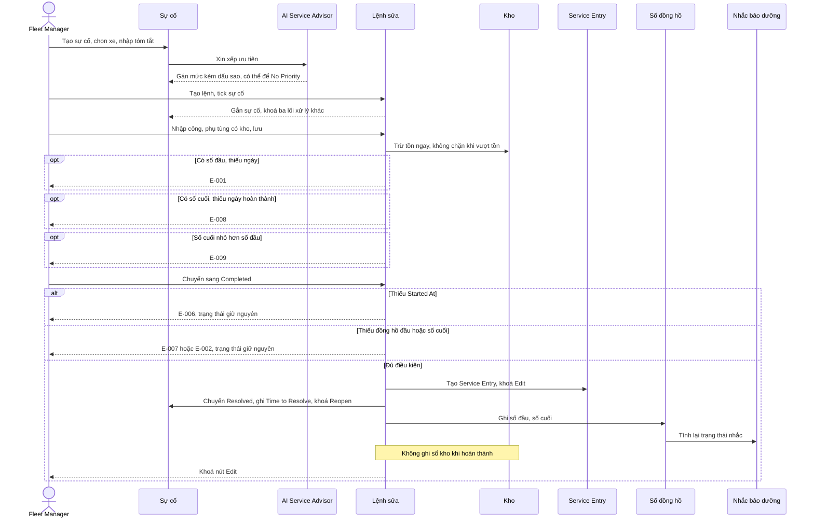
```mermaid
sequenceDiagram
    actor FM as Fleet Manager
    participant I as Sự cố
    participant AI as AI Service Advisor
    participant W as Lệnh sửa
    participant K as Kho
    participant S as Service Entry
    participant M as Số đồng hồ
    participant R as Nhắc bảo dưỡng
    FM->>I: Tạo sự cố, chọn xe, nhập tóm tắt
    I->>AI: Xin xếp ưu tiên
    AI-->>I: Gán mức kèm dấu sao, có thể để No Priority
    FM->>W: Tạo lệnh, tick sự cố
    W-->>I: Gắn sự cố, khoá ba lối xử lý khác
    FM->>W: Nhập công, phụ tùng có kho, lưu
    W->>K: Trừ tồn ngay, không chặn khi vượt tồn
    opt Có số đầu, thiếu ngày
        W-->>FM: E-001
    end
    opt Có số cuối, thiếu ngày hoàn thành
        W-->>FM: E-008
    end
    opt Số cuối nhỏ hơn số đầu
        W-->>FM: E-009
    end
    FM->>W: Chuyển sang Completed
    alt Thiếu Started At
        W-->>FM: E-006, trạng thái giữ nguyên
    else Thiếu đồng hồ đầu hoặc số cuối
        W-->>FM: E-007 hoặc E-002, trạng thái giữ nguyên
    else Đủ điều kiện
        W->>S: Tạo Service Entry, khoá Edit
        W->>I: Chuyển Resolved, ghi Time to Resolve, khoá Reopen
        W->>M: Ghi số đầu, số cuối
        M->>R: Tính lại trạng thái nhắc
        Note over W,K: Không ghi sổ kho khi hoàn thành
        W-->>FM: Khoá nút Edit
    end
```

## Flow 2: Mở lại và hoàn thành lại lệnh (`Chạy` #104)

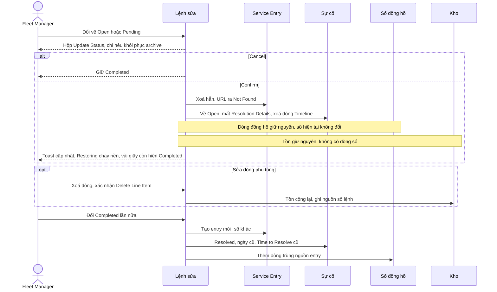
```mermaid
sequenceDiagram
    actor FM as Fleet Manager
    participant W as Lệnh sửa
    participant S as Service Entry
    participant I as Sự cố
    participant M as Số đồng hồ
    participant K as Kho
    FM->>W: Đổi về Open hoặc Pending
    W-->>FM: Hộp Update Status, chỉ nêu khôi phục archive
    alt Cancel
        W-->>FM: Giữ Completed
    else Confirm
        W->>S: Xoá hẳn, URL ra Not Found
        W->>I: Về Open, mất Resolution Details, xoá dòng Timeline
        Note over W,M: Dòng đồng hồ giữ nguyên, số hiện tại không đổi
        Note over W,K: Tồn giữ nguyên, không có dòng sổ
        W-->>FM: Toast cập nhật, Restoring chạy nền, vài giây còn hiện Completed
    end
    opt Sửa dòng phụ tùng
        FM->>W: Xoá dòng, xác nhận Delete Line Item
        W->>K: Tồn cộng lại, ghi nguồn số lệnh
    end
    FM->>W: Đổi Completed lần nữa
    W->>S: Tạo entry mới, số khác
    W->>I: Resolved, ngày cũ, Time to Resolve cũ
    W->>M: Thêm dòng trùng nguồn entry
```

## Flow 3: Từ mã lỗi đến sự cố (`Xem`, `Docs`)

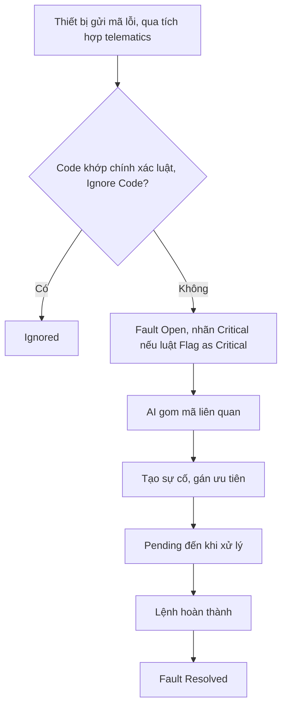
```mermaid
flowchart TD
    A["Thiết bị gửi mã lỗi, qua tích hợp telematics"] --> B{"Code khớp chính xác luật, Ignore Code?"}
    B -->|"Có"| C["Ignored"]
    B -->|"Không"| D["Fault Open, nhãn Critical nếu luật Flag as Critical"]
    D --> E["AI gom mã liên quan"]
    E --> F["Tạo sự cố, gán ưu tiên"]
    F --> G["Pending đến khi xử lý"]
    G --> H["Lệnh hoàn thành"]
    H --> I["Fault Resolved"]
```

## Flow 4: Xử lý sự cố, chọn nhánh (`Chạy` bốn nhánh; Shop `Xem`)

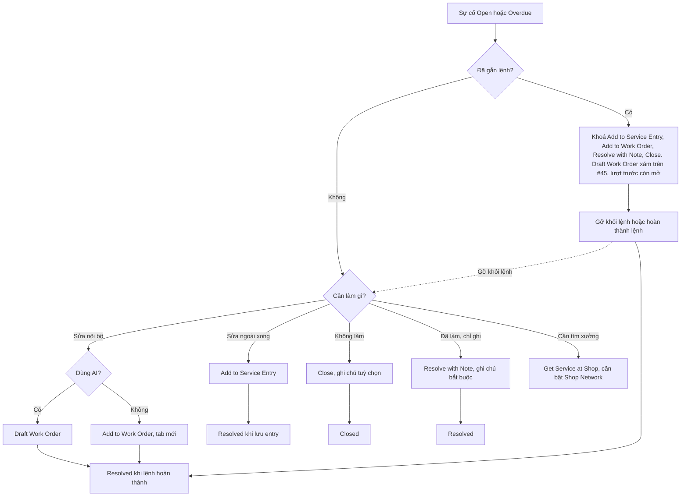
```mermaid
flowchart TD
    A["Sự cố Open hoặc Overdue"] --> L{"Đã gắn lệnh?"}
    L -->|"Có"| M["Khoá Add to Service Entry, Add to Work Order, Resolve with Note, Close. Draft Work Order xám trên #45, lượt trước còn mở"]
    M --> N["Gỡ khỏi lệnh hoặc hoàn thành lệnh"]
    N -.->|"Gỡ khỏi lệnh"| B
    N --> K["Resolved khi lệnh hoàn thành"]
    L -->|"Không"| B{"Cần làm gì?"}
    B -->|"Không làm"| C["Close, ghi chú tuỳ chọn"]
    B -->|"Đã làm, chỉ ghi"| D["Resolve with Note, ghi chú bắt buộc"]
    B -->|"Sửa ngoài xong"| E["Add to Service Entry"]
    B -->|"Sửa nội bộ"| F{"Dùng AI?"}
    F -->|"Có"| H["Draft Work Order"]
    F -->|"Không"| G["Add to Work Order, tab mới"]
    B -->|"Cần tìm xưởng"| I["Get Service at Shop, cần bật Shop Network"]
    E --> J["Resolved khi lưu entry"]
    G --> K
    H --> K
    C --> O["Closed"]
    D --> P["Resolved"]
```

## Flow 5: Hạn và quá hạn của sự cố (`Chạy` #33 đến #38)

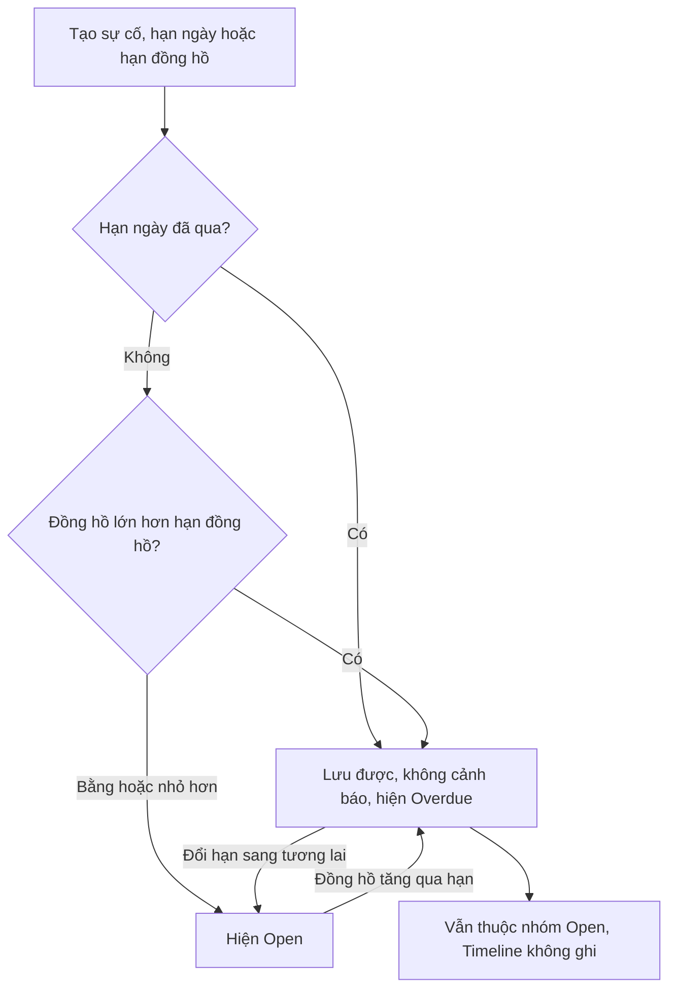
```mermaid
flowchart TD
    A["Tạo sự cố, hạn ngày hoặc hạn đồng hồ"] --> B{"Hạn ngày đã qua?"}
    B -->|"Có"| C["Lưu được, không cảnh báo, hiện Overdue"]
    B -->|"Không"| D{"Đồng hồ lớn hơn hạn đồng hồ?"}
    D -->|"Có"| C
    D -->|"Bằng hoặc nhỏ hơn"| E["Hiện Open"]
    E -->|"Đồng hồ tăng qua hạn"| C
    C -->|"Đổi hạn sang tương lai"| E
    C --> F["Vẫn thuộc nhóm Open, Timeline không ghi"]
```

## Flow 6: Đóng và mở lại sự cố (`Chạy` #36, #38)

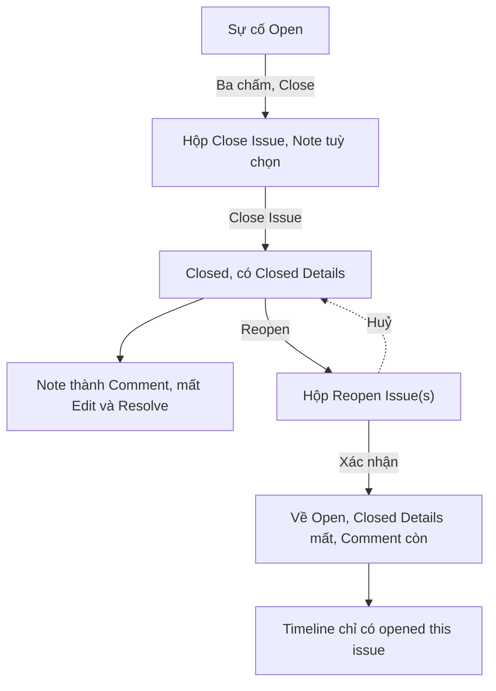
```mermaid
flowchart TD
    A["Sự cố Open"] -->|"Ba chấm, Close"| B["Hộp Close Issue, Note tuỳ chọn"]
    B -->|"Close Issue"| C["Closed, có Closed Details"]
    C --> D["Note thành Comment, mất Edit và Resolve"]
    C -->|"Reopen"| E["Hộp Reopen Issue(s)"]
    E -->|"Xác nhận"| F["Về Open, Closed Details mất, Comment còn"]
    E -.->|"Huỷ"| C
    F --> G["Timeline chỉ có opened this issue"]
```

## Flow 7: Giải quyết kèm ghi chú (`Chạy` #35)

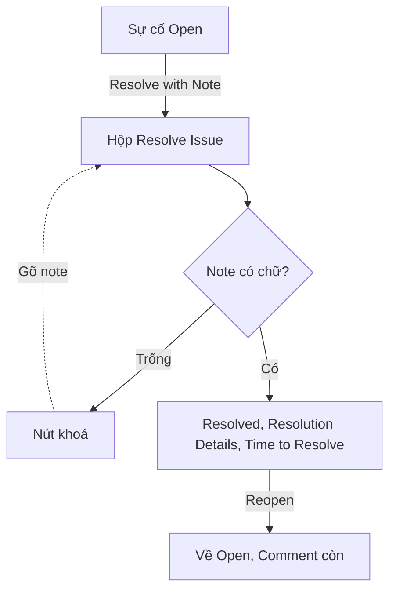
```mermaid
flowchart TD
    A["Sự cố Open"] -->|"Resolve with Note"| B["Hộp Resolve Issue"]
    B --> C{"Note có chữ?"}
    C -->|"Trống"| D["Nút khoá"]
    D -.->|"Gõ note"| B
    C -->|"Có"| E["Resolved, Resolution Details, Time to Resolve"]
    E -->|"Reopen"| F["Về Open, Comment còn"]
```

## Flow 8: Thêm vào Service Entry và mở lại (`Chạy` #37, #52, entry 57856983)

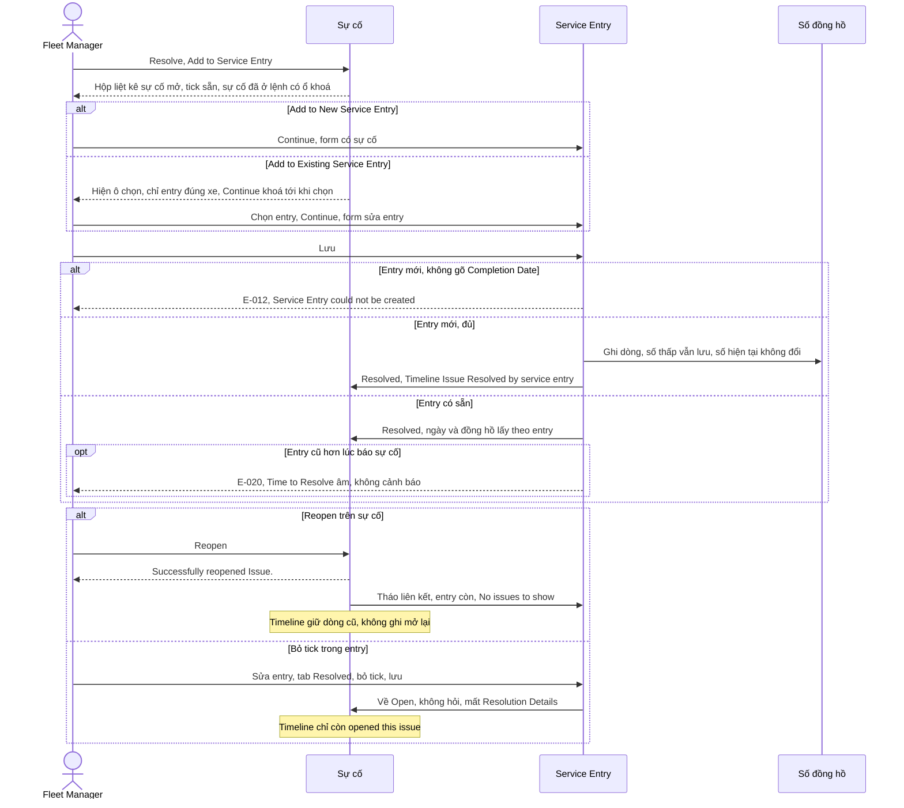
```mermaid
sequenceDiagram
    actor FM as Fleet Manager
    participant I as Sự cố
    participant S as Service Entry
    participant M as Số đồng hồ
    FM->>I: Resolve, Add to Service Entry
    I-->>FM: Hộp liệt kê sự cố mở, tick sẵn, sự cố đã ở lệnh có ổ khoá
    alt Add to New Service Entry
        FM->>S: Continue, form có sự cố
    else Add to Existing Service Entry
        I-->>FM: Hiện ô chọn, chỉ entry đúng xe, Continue khoá tới khi chọn
        FM->>S: Chọn entry, Continue, form sửa entry
    end
    FM->>S: Lưu
    alt Entry mới, không gõ Completion Date
        S-->>FM: E-012, Service Entry could not be created
    else Entry mới, đủ
        S->>M: Ghi dòng, số thấp vẫn lưu, số hiện tại không đổi
        S->>I: Resolved, Timeline Issue Resolved by service entry
    else Entry có sẵn
        S->>I: Resolved, ngày và đồng hồ lấy theo entry
        opt Entry cũ hơn lúc báo sự cố
            S-->>FM: E-020, Time to Resolve âm, không cảnh báo
        end
    end
    alt Reopen trên sự cố
        FM->>I: Reopen
        I-->>FM: Successfully reopened Issue.
        I->>S: Tháo liên kết, entry còn, No issues to show
        Note over I: Timeline giữ dòng cũ, không ghi mở lại
    else Bỏ tick trong entry
        FM->>S: Sửa entry, tab Resolved, bỏ tick, lưu
        S->>I: Về Open, không hỏi, mất Resolution Details
        Note over I: Timeline chỉ còn opened this issue
    end
```

Sự cố đang ở lệnh khác có ổ khoá, không bỏ tick được từ entry (`Chạy` #35, #37). Lưu entry không gắn sự cố thì không đóng, không gợi ý đóng sự cố khớp nội dung (`Chạy` entry 57902070 sau khoảng 1 đến 2 giờ, entry 57903452 sau khoảng 15 phút; Issue Resolution chưa bấm vì có câu điều khoản, OQ-22).

## Flow 9: Gắn, khoá, gỡ sự cố ở lệnh (`Chạy` #34, #38, #45, #103, #107)

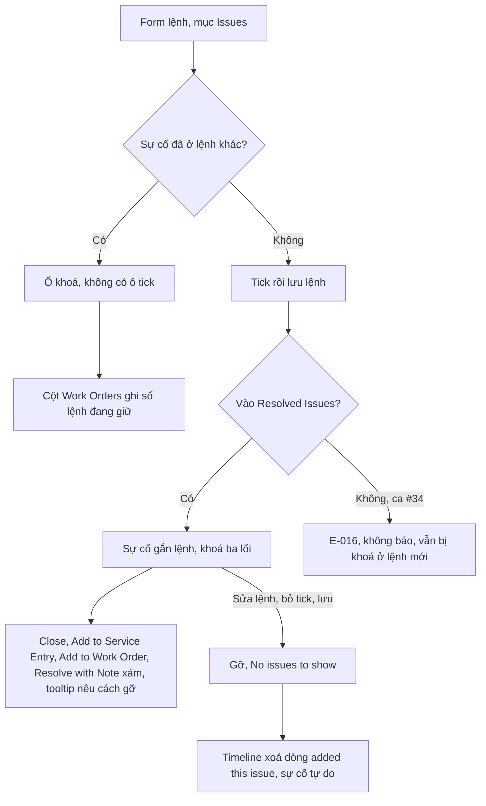
```mermaid
flowchart TD
    A["Form lệnh, mục Issues"] --> B{"Sự cố đã ở lệnh khác?"}
    B -->|"Có"| C["Ổ khoá, không có ô tick"]
    C --> D["Cột Work Orders ghi số lệnh đang giữ"]
    B -->|"Không"| E["Tick rồi lưu lệnh"]
    E --> F{"Vào Resolved Issues?"}
    F -->|"Có"| G["Sự cố gắn lệnh, khoá ba lối"]
    F -->|"Không, ca #34"| H["E-016, không báo, vẫn bị khoá ở lệnh mới"]
    G --> L["Close, Add to Service Entry, Add to Work Order, Resolve with Note xám, tooltip nêu cách gỡ"]
    G -->|"Sửa lệnh, bỏ tick, lưu"| I["Gỡ, No issues to show"]
    I --> J["Timeline xoá dòng added this issue, sự cố tự do"]
```

## Flow 10: Dòng phụ tùng và tồn kho (`Chạy` #103, #104, WO #102)

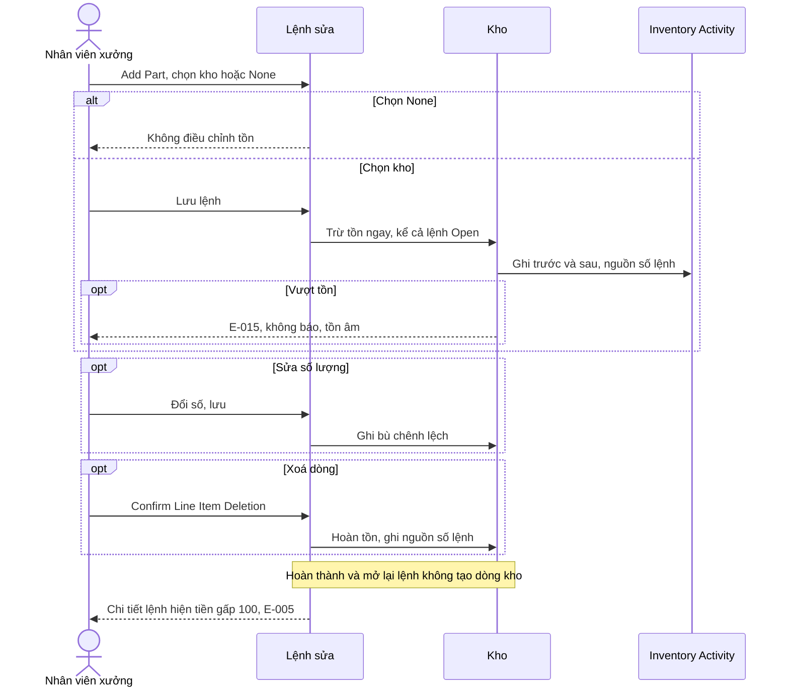
```mermaid
sequenceDiagram
    actor TV as Nhân viên xưởng
    participant W as Lệnh sửa
    participant K as Kho
    participant A as Inventory Activity
    TV->>W: Add Part, chọn kho hoặc None
    alt Chọn None
        W-->>TV: Không điều chỉnh tồn
    else Chọn kho
        TV->>W: Lưu lệnh
        W->>K: Trừ tồn ngay, kể cả lệnh Open
        K->>A: Ghi trước và sau, nguồn số lệnh
        opt Vượt tồn
            K-->>TV: E-015, không báo, tồn âm
        end
    end
    opt Sửa số lượng
        TV->>W: Đổi số, lưu
        W->>K: Ghi bù chênh lệch
    end
    opt Xoá dòng
        TV->>W: Confirm Line Item Deletion
        W->>K: Hoàn tồn, ghi nguồn số lệnh
    end
    Note over W,K: Hoàn thành và mở lại lệnh không tạo dòng kho
    W-->>TV: Chi tiết lệnh hiện tiền gấp 100, E-005
```

## Flow 11: Điều kiện hoàn thành lệnh (`Chạy` #104; luật khác `Xem`)

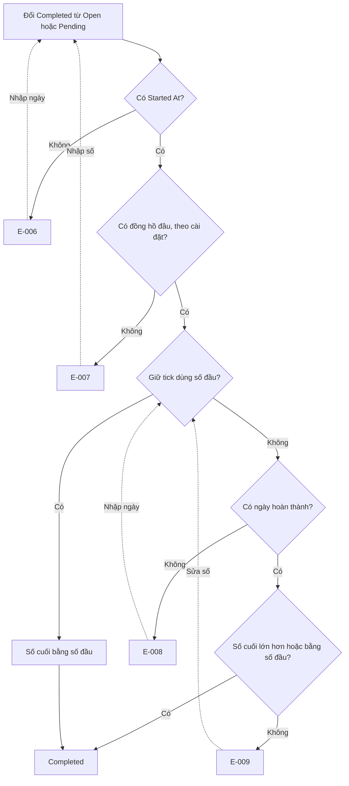
```mermaid
flowchart TD
    A["Đổi Completed từ Open hoặc Pending"] --> B{"Có Started At?"}
    B -->|"Không"| C["E-006"]
    C -.->|"Nhập ngày"| A
    B -->|"Có"| D{"Có đồng hồ đầu, theo cài đặt?"}
    D -->|"Không"| E["E-007"]
    E -.->|"Nhập số"| A
    D -->|"Có"| F{"Giữ tick dùng số đầu?"}
    F -->|"Có"| G["Số cuối bằng số đầu"]
    F -->|"Không"| H{"Có ngày hoàn thành?"}
    H -->|"Không"| I["E-008"]
    I -.->|"Nhập ngày"| F
    H -->|"Có"| J{"Số cuối lớn hơn hoặc bằng số đầu?"}
    J -->|"Không"| K["E-009"]
    K -.->|"Sửa số"| F
    J -->|"Có"| L["Completed"]
    G --> L
```

## Flow 12: AI soạn lệnh (`Chạy` #45, #46, #52, #53, #106, #110)

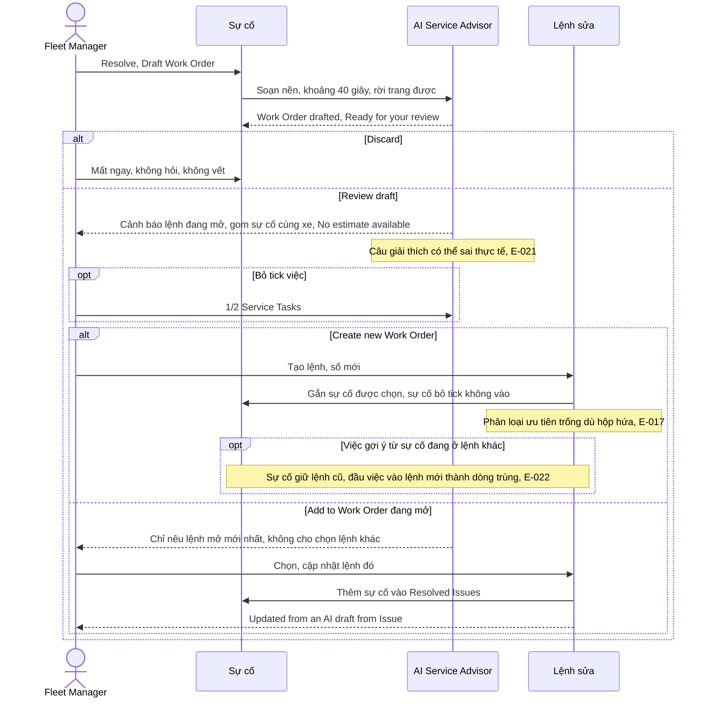
```mermaid
sequenceDiagram
    actor FM as Fleet Manager
    participant I as Sự cố
    participant AI as AI Service Advisor
    participant W as Lệnh sửa
    FM->>I: Resolve, Draft Work Order
    I->>AI: Soạn nền, khoảng 40 giây, rời trang được
    AI-->>I: Work Order drafted, Ready for your review
    alt Discard
        FM->>I: Mất ngay, không hỏi, không vết
    else Review draft
        AI-->>FM: Cảnh báo lệnh đang mở, gom sự cố cùng xe, No estimate available
        Note over AI: Câu giải thích có thể sai thực tế, E-021
        opt Bỏ tick việc
            FM->>AI: 1/2 Service Tasks
        end
        alt Create new Work Order
            FM->>W: Tạo lệnh, số mới
            W->>I: Gắn sự cố được chọn, sự cố bỏ tick không vào
            Note over W: Phân loại ưu tiên trống dù hộp hứa, E-017
            opt Việc gợi ý từ sự cố đang ở lệnh khác
                Note over W,I: Sự cố giữ lệnh cũ, đầu việc vào lệnh mới thành dòng trùng, E-022
            end
        else Add to Work Order đang mở
            AI-->>FM: Chỉ nêu lệnh mở mới nhất, không cho chọn lệnh khác
            FM->>W: Chọn, cập nhật lệnh đó
            W->>I: Thêm sự cố vào Resolved Issues
            W-->>FM: Updated from an AI draft from Issue
        end
    end
```

## Flow 13: AI đánh giá lệnh (`Chạy` #103, #104, #106, #107)

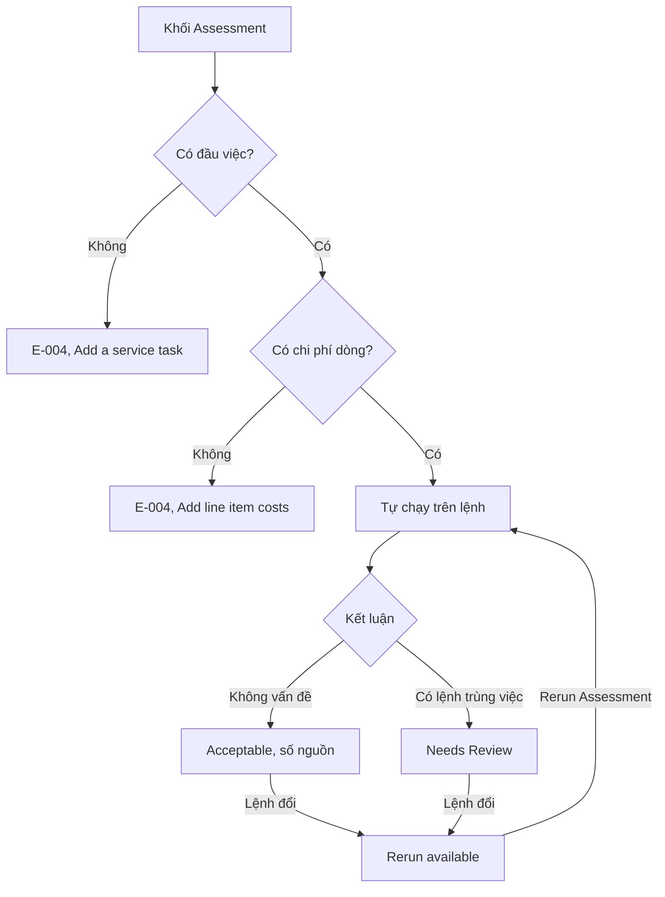
```mermaid
flowchart TD
    A["Khối Assessment"] --> B{"Có đầu việc?"}
    B -->|"Không"| C["E-004, Add a service task"]
    B -->|"Có"| D{"Có chi phí dòng?"}
    D -->|"Không"| E["E-004, Add line item costs"]
    D -->|"Có"| F["Tự chạy trên lệnh"]
    F --> G{"Kết luận"}
    G -->|"Không vấn đề"| H["Acceptable, số nguồn"]
    G -->|"Có lệnh trùng việc"| I["Needs Review"]
    H -->|"Lệnh đổi"| J["Rerun available"]
    I -->|"Lệnh đổi"| J
    J -->|"Rerun Assessment"| F
```

Entry từ lệnh không tự chạy, phải bấm Run Assessment. Entry không có dòng: "Add a line item to run an assessment." Kết luận không bàn giá sai, xem Mục 11 của spec.

## Flow 14: Sao chép lệnh (`Chạy`)

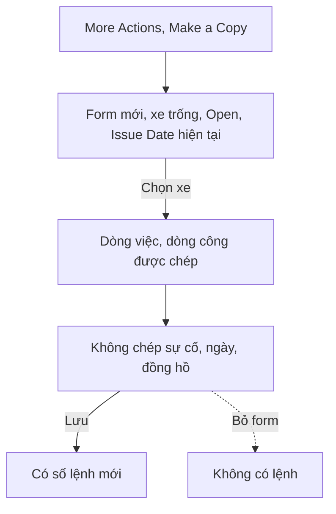
```mermaid
flowchart TD
    A["More Actions, Make a Copy"] --> B["Form mới, xe trống, Open, Issue Date hiện tại"]
    B -->|"Chọn xe"| C["Dòng việc, dòng công được chép"]
    C --> D["Không chép sự cố, ngày, đồng hồ"]
    D -->|"Lưu"| E["Có số lệnh mới"]
    D -.->|"Bỏ form"| F["Không có lệnh"]
```

## Flow 15: Đầu việc (`Chạy` TEST-SUA-DV-A, TEST-SUA-DV-B)

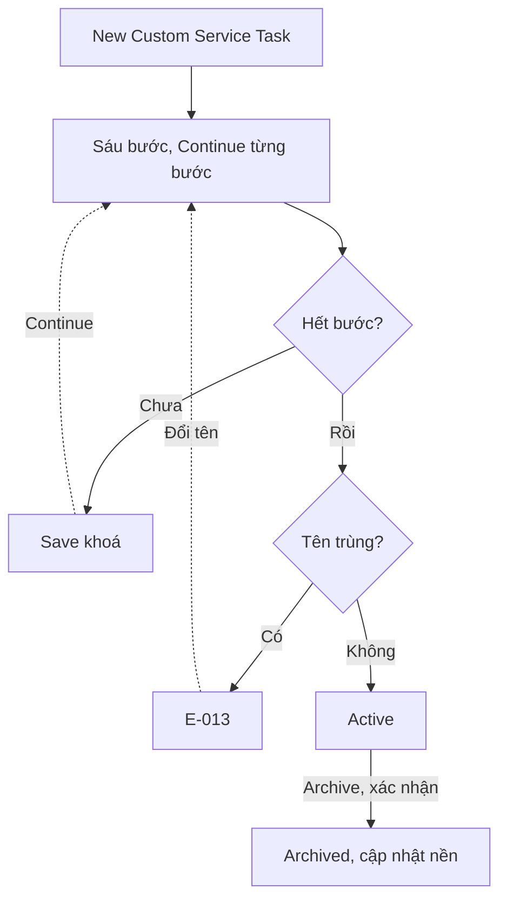
```mermaid
flowchart TD
    A["New Custom Service Task"] --> B["Sáu bước, Continue từng bước"]
    B --> C{"Hết bước?"}
    C -->|"Chưa"| D["Save khoá"]
    D -.->|"Continue"| B
    C -->|"Rồi"| E{"Tên trùng?"}
    E -->|"Có"| F["E-013"]
    F -.->|"Đổi tên"| B
    E -->|"Không"| G["Active"]
    G -->|"Archive, xác nhận"| H["Archived, cập nhật nền"]
```

## Flow 16: Bảo hành và cơ hội trên lệnh (`Chạy` nhóm Phương tiện, TEST-XE-01, WO #100; `Chạy` TEST-SUA-01, #107, #110)

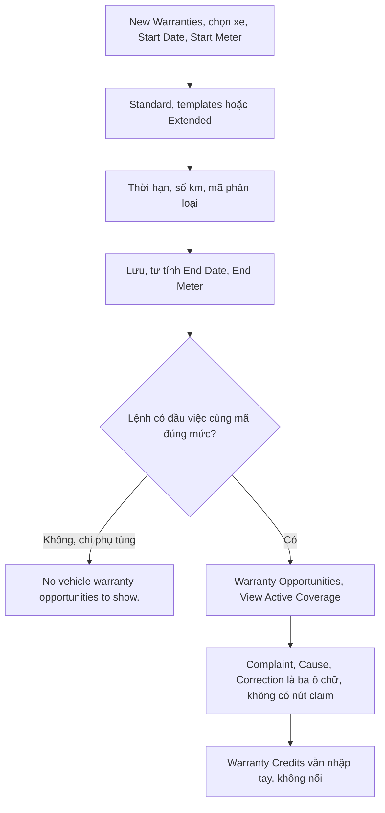
```mermaid
flowchart TD
    A["New Warranties, chọn xe, Start Date, Start Meter"] --> B["Standard, templates hoặc Extended"]
    B --> C["Thời hạn, số km, mã phân loại"]
    C --> D["Lưu, tự tính End Date, End Meter"]
    D --> E{"Lệnh có đầu việc cùng mã đúng mức?"}
    E -->|"Không, chỉ phụ tùng"| F["No vehicle warranty opportunities to show."]
    E -->|"Có"| G["Warranty Opportunities, View Active Coverage"]
    G --> H["Complaint, Cause, Correction là ba ô chữ, không có nút claim"]
    H --> I["Warranty Credits vẫn nhập tay, không nối"]
```

Khớp chi tiết ở Flow 21.

## Flow 17: Nhận hàng đơn mua vào lệnh (`Chạy` nhóm Kho, D14, D15)

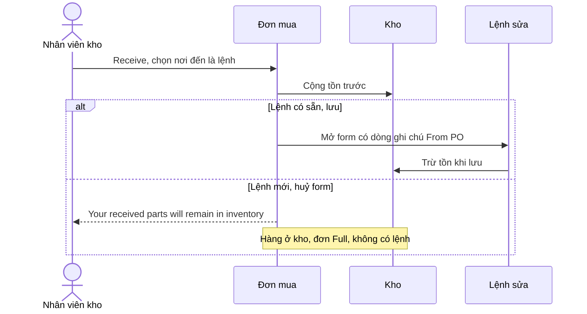
```mermaid
sequenceDiagram
    actor TV as Nhân viên kho
    participant P as Đơn mua
    participant K as Kho
    participant W as Lệnh sửa
    TV->>P: Receive, chọn nơi đến là lệnh
    P->>K: Cộng tồn trước
    alt Lệnh có sẵn, lưu
        P->>W: Mở form có dòng ghi chú From PO
        W->>K: Trừ tồn khi lưu
    else Lệnh mới, huỷ form
        P-->>TV: Your received parts will remain in inventory
        Note over P,K: Hàng ở kho, đơn Full, không có lệnh
    end
```

## Flow 18: Kỹ thuật viên mẫu làm kẹt lệnh (`Chạy` #103, dữ liệu mẫu)

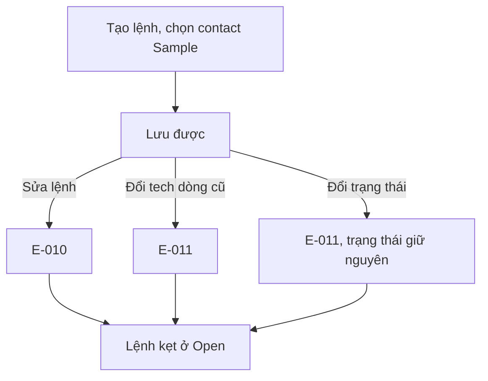
```mermaid
flowchart TD
    A["Tạo lệnh, chọn contact Sample"] --> B["Lưu được"]
    B -->|"Sửa lệnh"| C["E-010"]
    B -->|"Đổi tech dòng cũ"| D["E-011"]
    B -->|"Đổi trạng thái"| E["E-011, trạng thái giữ nguyên"]
    C --> F["Lệnh kẹt ở Open"]
    D --> F
    E --> F
```

## Flow 19: Ghi công trên dòng việc (`Chạy` #107)

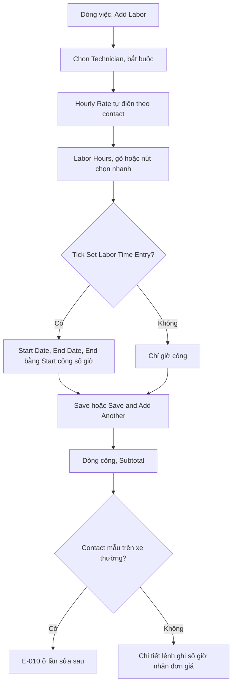
```mermaid
flowchart TD
    A["Dòng việc, Add Labor"] --> B["Chọn Technician, bắt buộc"]
    B --> C["Hourly Rate tự điền theo contact"]
    C --> D["Labor Hours, gõ hoặc nút chọn nhanh"]
    D --> E{"Tick Set Labor Time Entry?"}
    E -->|"Có"| F["Start Date, End Date, End bằng Start cộng số giờ"]
    E -->|"Không"| G["Chỉ giờ công"]
    F --> H["Save hoặc Save and Add Another"]
    G --> H
    H --> I["Dòng công, Subtotal"]
    I --> J{"Contact mẫu trên xe thường?"}
    J -->|"Có"| K["E-010 ở lần sửa sau"]
    J -->|"Không"| L["Chi tiết lệnh ghi số giờ nhân đơn giá"]
```

Không có nút bấm giờ Start, Stop ở form và chi tiết lệnh trên web; báo cáo `work_orders/labor_time_entries` chỉ lọc Contacts, Started at, Ended at. Đơn giá hiển thị lệch giữa các màn: E-014.

## Flow 20: Tính tổng lệnh (`Chạy` #107, thứ tự `Suy` từ các bộ số)

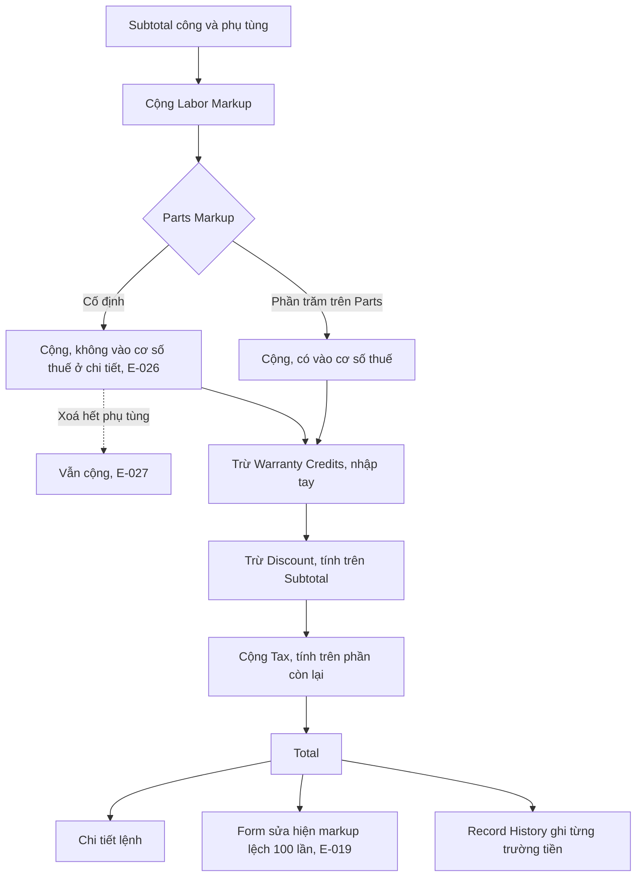
```mermaid
flowchart TD
    A["Subtotal công và phụ tùng"] --> B["Cộng Labor Markup"]
    B --> J{"Parts Markup"}
    J -->|"Phần trăm trên Parts"| K["Cộng, có vào cơ số thuế"]
    J -->|"Cố định"| L["Cộng, không vào cơ số thuế ở chi tiết, E-026"]
    L -.->|"Xoá hết phụ tùng"| M["Vẫn cộng, E-027"]
    K --> C["Trừ Warranty Credits, nhập tay"]
    L --> C
    C --> D["Trừ Discount, tính trên Subtotal"]
    D --> E["Cộng Tax, tính trên phần còn lại"]
    E --> F["Total"]
    F --> G["Chi tiết lệnh"]
    F --> H["Form sửa hiện markup lệch 100 lần, E-019"]
    F --> I["Record History ghi từng trường tiền"]
```

Mỗi ô đổi được giữa phần trăm và số tiền. Đơn giá phụ tùng tự điền từ danh mục làm sai cả Total: E-005. Bộ số thử: C125, C126, C217 đến C220 ở spec.

## Flow 21: Khớp cơ hội bảo hành (`Chạy` #106, #107, #110)

```mermaid
flowchart TD
    A["Mở form sửa lệnh, hoặc lưu lại"] --> B{"Bảo hành của xe Active?"}
    B -->|"Expired"| C["Không gợi ý, vẫn tính vào total"]
    B -->|"Expiring Soon, một lần đo"| D["Không gợi ý dù còn hiệu lực"]
    B -->|"Active"| E{"Mã bảo hành cùng mức với dòng việc?"}
    E -->|"Mã hệ thống, dòng cùng mức"| F["Warranty Opportunities"]
    E -->|"Mã đủ hai mức, dòng khớp"| F
    E -->|"Mã hệ thống, dòng có assembly"| G["Không gợi ý"]
    E -->|"Chỉ phụ tùng"| G
    F --> H["Điền Complaint, Cause, Correction"]
    H --> I["Lưu, chi tiết hiện ba nội dung"]
    A -.->|"Không sửa lệnh"| J["Trang chi tiết giữ kết quả cũ, không lan khi bảo hành đổi"]
```

## Flow 22: Link Issues trên dòng việc (`Chạy` #45, #107)

```mermaid
flowchart TD
    A["Dòng việc, Link Issues"] --> B{"Sự cố đã ở lệnh khác?"}
    B -->|"Có"| C["Ổ khoá, tooltip nêu cách gỡ"]
    B -->|"Không"| D["Tick rồi Save"]
    D --> E{"Tick kịp ghi nhận?"}
    E -->|"Save quá nhanh"| F["E-025, hộp đóng, không tick"]
    F -.->|"Làm lại"| A
    E -->|"Có"| G["Tự tick ở khối Issues, Linked Line Items hiện tên dòng"]
    G --> H["Chi tiết lệnh hiện ở Resolved Issues và dưới dòng, kể cả khi lệnh Open"]
```

## Flow 23: Luật mã lỗi (`Xem`, mở hộp rồi Cancel, không lưu)

```mermaid
flowchart TD
    A["Fault, View Fault Rule hoặc Settings, Fault Rules"] --> B["Add Fault Rule"]
    B --> C["Code bắt buộc, khớp chính xác mã đến"]
    C --> D["Name, Description ghi đè giá trị của mã đến"]
    D --> E{"Priority Handling"}
    E -->|"Off"| F["Không xử lý đặc biệt"]
    E -->|"Ignore Code"| G["Bỏ qua mọi lần xuất hiện, mọi xe"]
    E -->|"Flag as Critical"| H["Nhãn Critical, nêu ở dashboard và trang xe"]
```

Hiệu ứng ba giá trị lấy từ câu mô tả trong hộp, không có thiết bị để kiểm chứng.

## Flow 24: Người theo dõi (`Chạy` #106, #107, #110, TEST-SUA-01)

```mermaid
flowchart TD
    A["Tạo lệnh, sự cố, kể cả từ nháp AI"] --> B["Người bấm thành người theo dõi"]
    B -->|"Unwatch, không hỏi"| C["Avatar mất, nút Watch"]
    C -->|"Watch"| B
    C -->|"Được giao lệnh, là user"| B
    D["Giao lệnh cho liên hệ không đăng nhập"] --> E["Không thành người theo dõi"]
    F["Xe"] --> G["Không tự theo dõi, nút Watch"]
    B --> H["ADD WATCHER, tìm user, tài khoản một người nên mục xám"]
```

Assigned To có cả Employee, Operator, Account Owner, Fleetio Automation, không chỉ Technician.

## Flow 25: In lệnh (`Chạy` #107)

```mermaid
flowchart TD
    A["More Actions, Print"] --> B["Tab mới, PDF 2 trang"]
    B --> C["Trang 1: thông tin lệnh, xe, Line Items"]
    B --> D["Trang 2: Description, Summary từng khoản tiền"]
    C --> E["Giờ theo múi giờ tài khoản, web theo máy, E-028"]
    D --> F["Tiền dạng US, số khớp web trên lệnh chỉ có công"]
    C --> G["Không in Complaint, Cause, Correction trong phần đọc được"]
    A -.->|"Email PDF, không chạy"| H["Gửi email, chưa kiểm"]
```
