# Nền tảng SaaS — Flows

## Flow 1: Kiểm quyền hai lớp (`Suy` từ `Docs`, cấu hình `Xem`, chưa kiểm hiệu lực thật)

Bước đảo ngược: đổi Role hoặc Record Set của người dùng; Record Type của Record Set không đổi được, phải tạo mới (E-fleetio-saas-platform-008).

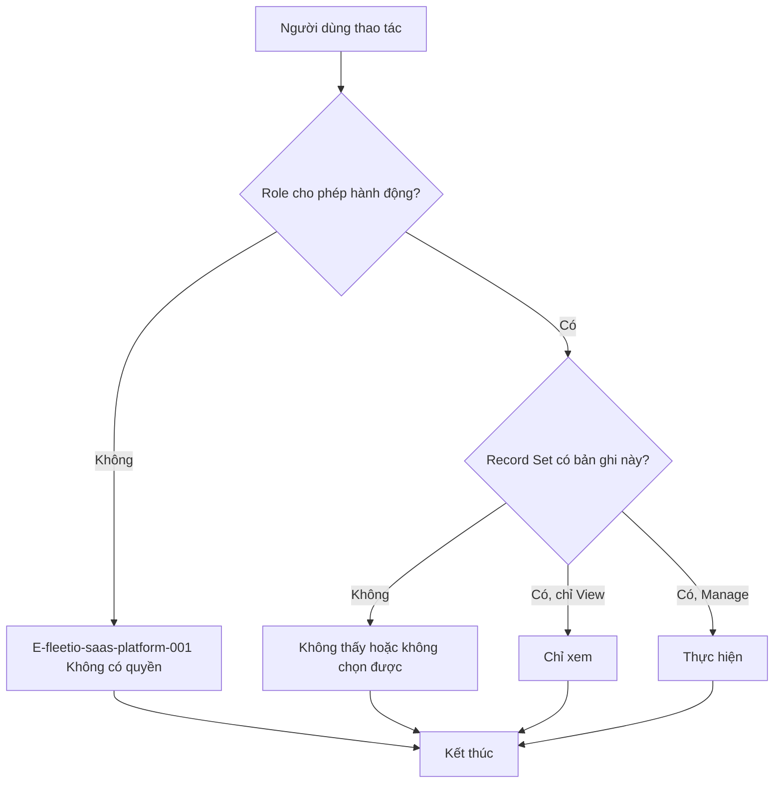
```mermaid
flowchart TD
    A["Người dùng thao tác"] --> B{"Role cho phép hành động?"}
    B -->|"Không"| C["E-fleetio-saas-platform-001 Không có quyền"]
    B -->|"Có"| D{"Record Set có bản ghi này?"}
    D -->|"Không"| E["Không thấy hoặc không chọn được"]
    D -->|"Có, chỉ View"| F["Chỉ xem"]
    D -->|"Có, Manage"| G["Thực hiện"]
    C --> Z["Kết thúc"]
    E --> Z
    F --> Z
    G --> Z
```

## Flow 2: Tự động hoá (`Chạy` Issue, Add Comment, Update Field, Create Record)

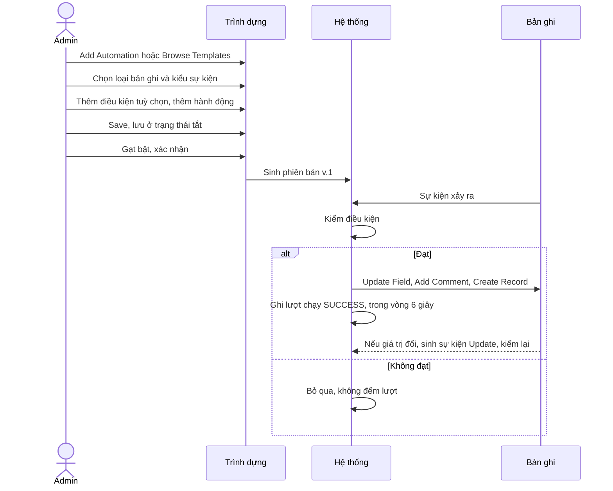
```mermaid
sequenceDiagram
    actor A as Admin
    participant B as Trình dựng
    participant E as Hệ thống
    participant R as Bản ghi
    A->>B: Add Automation hoặc Browse Templates
    A->>B: Chọn loại bản ghi và kiểu sự kiện
    A->>B: Thêm điều kiện tuỳ chọn, thêm hành động
    A->>B: Save, lưu ở trạng thái tắt
    A->>B: Gạt bật, xác nhận
    B->>E: Sinh phiên bản v.1
    R->>E: Sự kiện xảy ra
    E->>E: Kiểm điều kiện
    alt Đạt
        E->>R: Update Field, Add Comment, Create Record
        E->>E: Ghi lượt chạy SUCCESS, trong vòng 6 giây
        R-->>E: Nếu giá trị đổi, sinh sự kiện Update, kiểm lại
    else Không đạt
        E->>E: Bỏ qua, không đếm lượt
    end
```

## Flow 3: Khách mới (`Chạy` một phần)

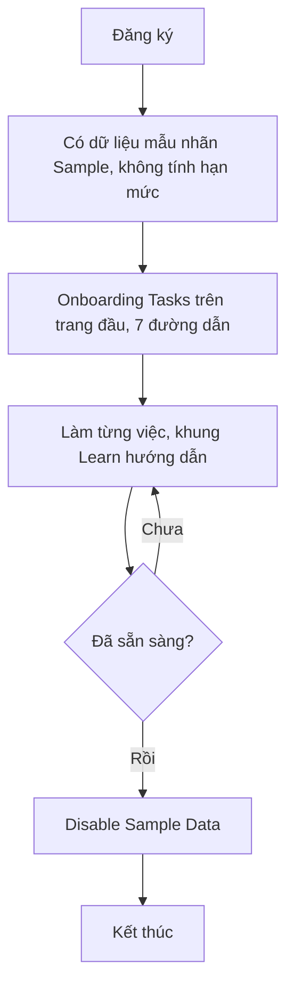
```mermaid
flowchart TD
    A["Đăng ký"] --> B["Có dữ liệu mẫu nhãn Sample, không tính hạn mức"]
    B --> C["Onboarding Tasks trên trang đầu, 7 đường dẫn"]
    C --> D["Làm từng việc, khung Learn hướng dẫn"]
    D --> E{"Đã sẵn sàng?"}
    E -->|"Chưa"| D
    E -->|"Rồi"| F["Disable Sample Data"]
    F --> G["Kết thúc"]
```

## Flow 4: Tạo và bật automation từ mẫu, có nhánh lỗi và đảo ngược (`Chạy`)

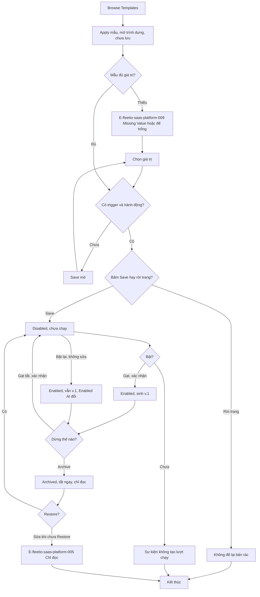
```mermaid
flowchart TD
    A["Browse Templates"] --> B["Apply mẫu, mở trình dựng, chưa lưu"]
    B --> C{"Mẫu đủ giá trị?"}
    C -->|"Thiếu"| D["E-fleetio-saas-platform-009 Missing Value hoặc để trống"]
    D --> E["Chọn giá trị"]
    E --> F
    C -->|"Đủ"| F{"Có trigger và hành động?"}
    F -->|"Chưa"| G["Save mờ"]
    G --> E
    F -->|"Có"| H{"Bấm Save hay rời trang?"}
    H -->|"Rời trang"| I["Không để lại bản rác"]
    H -->|"Save"| J["Disabled, chưa chạy"]
    J --> K{"Bật?"}
    K -->|"Chưa"| L["Sự kiện không tạo lượt chạy"]
    K -->|"Gạt, xác nhận"| M["Enabled, sinh v.1"]
    M --> N{"Dừng thế nào?"}
    N -->|"Gạt tắt, xác nhận"| J
    J -->|"Bật lại, không sửa"| M2["Enabled, vẫn v.1, Enabled At đổi"]
    M2 --> N
    N -->|"Archive"| O["Archived, tắt ngay, chỉ đọc"]
    O --> P{"Restore?"}
    P -->|"Có"| J
    P -->|"Sửa khi chưa Restore"| Q["E-fleetio-saas-platform-005 Chỉ đọc"]
    I --> Z["Kết thúc"]
    L --> Z
    Q --> Z
```

## Flow 5: Một sự kiện đi qua automation (`Chạy`)

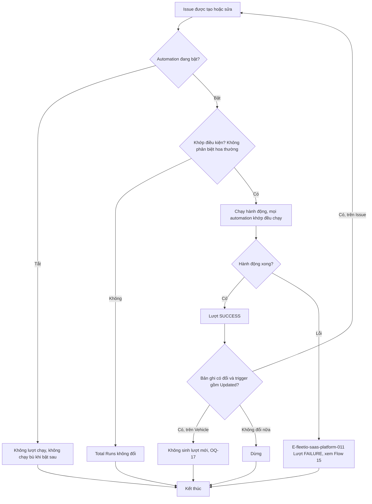
```mermaid
flowchart TD
    A["Issue được tạo hoặc sửa"] --> B{"Automation đang bật?"}
    B -->|"Tắt"| C["Không lượt chạy, không chạy bù khi bật sau"]
    B -->|"Bật"| D{"Khớp điều kiện? Không phân biệt hoa thường"}
    D -->|"Không"| E["Total Runs không đổi"]
    D -->|"Có"| F["Chạy hành động, mọi automation khớp đều chạy"]
    F --> G{"Hành động xong?"}
    G -->|"Có"| H["Lượt SUCCESS"]
    G -->|"Lỗi"| I["E-fleetio-saas-platform-011 Lượt FAILURE, xem Flow 15"]
    H --> J{"Bản ghi có đổi và trigger gồm Updated?"}
    J -->|"Có, trên Issue"| A
    J -->|"Có, trên Vehicle"| K2["Không sinh lượt mới, OQ-17"]
    J -->|"Không đổi nữa"| K["Dừng"]
    K2 --> Z
    C --> Z["Kết thúc"]
    E --> Z
    I --> Z
    K --> Z
```

Vòng lặp giữa hai automation lật giá trị chưa chạy (OQ-5). Lượt do automation gây ra vẫn ghi "Triggered By" là người tạo Issue; lượt thêm comment hoặc đổi Status xe đều ghi "Records: No records changed" (E-fleetio-saas-platform-021). Trigger Updated chạy trên mọi thay đổi của bản ghi, không chọn được theo trường.

## Flow 6: Sự cố sinh lệnh sửa (`Chạy` đến khi WO Open)

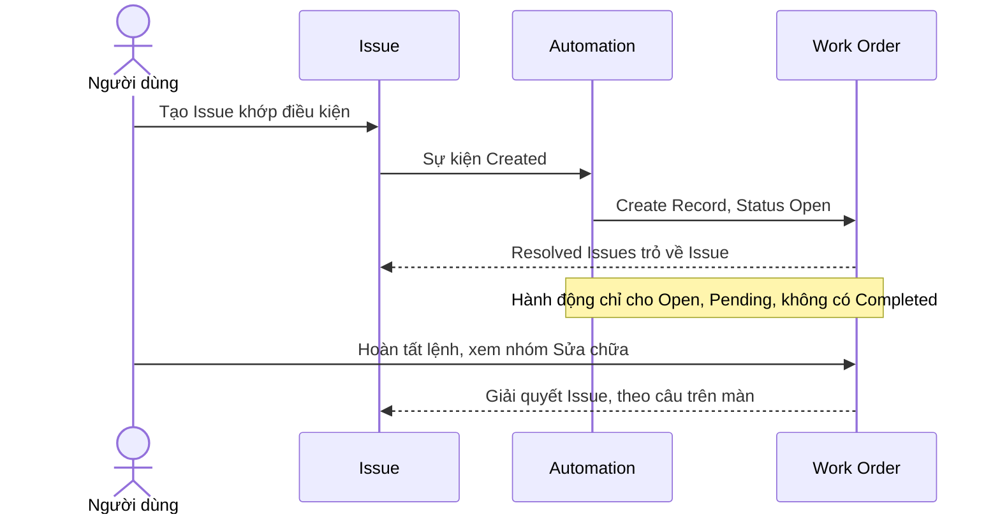
```mermaid
sequenceDiagram
    actor U as Người dùng
    participant I as Issue
    participant E as Automation
    participant W as Work Order
    U->>I: Tạo Issue khớp điều kiện
    I->>E: Sự kiện Created
    E->>W: Create Record, Status Open
    W-->>I: Resolved Issues trỏ về Issue
    Note over E,W: Hành động chỉ cho Open, Pending, không có Completed
    U->>W: Hoàn tất lệnh, xem nhóm Sửa chữa
    W-->>I: Giải quyết Issue, theo câu trên màn
```

## Flow 7: Tạo xe khi có hạn mức (`Chạy` nhánh chặn)

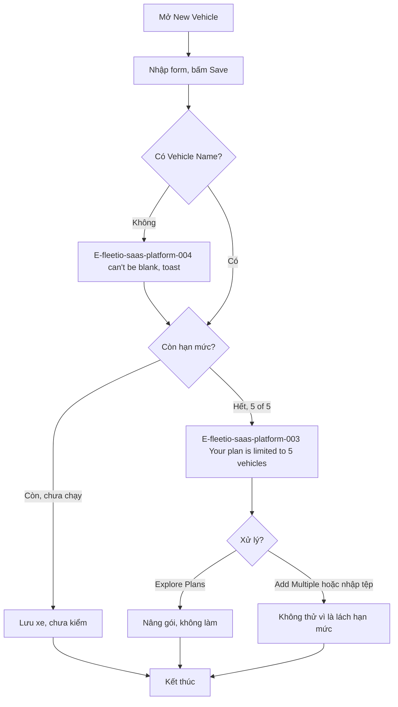
```mermaid
flowchart TD
    A["Mở New Vehicle"] --> B["Nhập form, bấm Save"]
    B --> C{"Có Vehicle Name?"}
    C -->|"Không"| D["E-fleetio-saas-platform-004 can't be blank, toast"]
    D --> E{"Còn hạn mức?"}
    C -->|"Có"| E
    E -->|"Hết, 5 of 5"| F["E-fleetio-saas-platform-003 Your plan is limited to 5 vehicles"]
    E -->|"Còn, chưa chạy"| G["Lưu xe, chưa kiểm"]
    F --> H{"Xử lý?"}
    H -->|"Explore Plans"| I["Nâng gói, không làm"]
    H -->|"Add Multiple hoặc nhập tệp"| J["Không thử vì là lách hạn mức"]
    G --> Z["Kết thúc"]
    I --> Z
    J --> Z
```

## Flow 8: Liên hệ thành người dùng (`Chạy` No Access, `Xem` Enable Access)

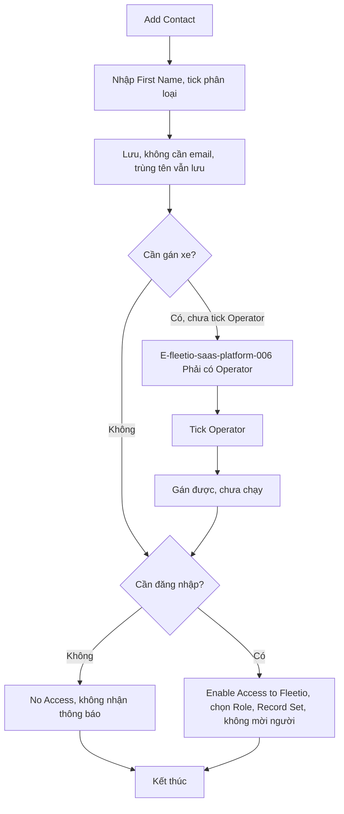
```mermaid
flowchart TD
    A["Add Contact"] --> B["Nhập First Name, tick phân loại"]
    B --> C["Lưu, không cần email, trùng tên vẫn lưu"]
    C --> D{"Cần gán xe?"}
    D -->|"Có, chưa tick Operator"| E["E-fleetio-saas-platform-006 Phải có Operator"]
    E --> F["Tick Operator"]
    F --> G["Gán được, chưa chạy"]
    D -->|"Không"| H{"Cần đăng nhập?"}
    G --> H
    H -->|"Không"| I["No Access, không nhận thông báo"]
    H -->|"Có"| J["Enable Access to Fleetio, chọn Role, Record Set, không mời người"]
    I --> Z["Kết thúc"]
    J --> Z
```

Form Enable Access đọc được ở lượt 3 (`Xem`, không lưu): Role mặc định Fleet Manager, Record Sets đều mặc định Full Access, thư mời gửi ngay trừ khi chọn Delay email invitation. Đề xuất Invlogis đảo mặc định (NFR-fleetio-saas-platform-014).

## Flow 9: Chia sẻ báo cáo (`Chạy`)

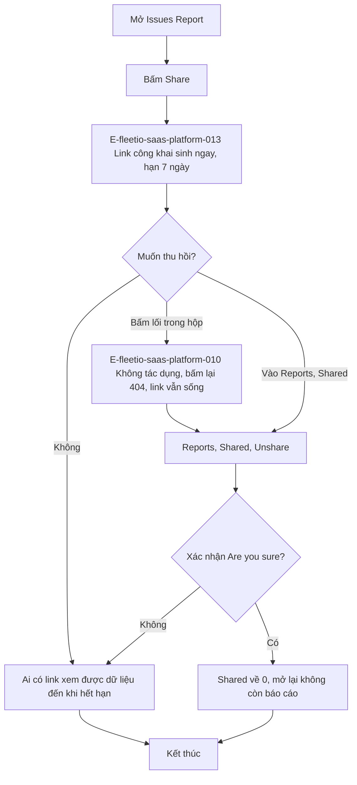
```mermaid
flowchart TD
    A["Mở Issues Report"] --> B["Bấm Share"]
    B --> C["E-fleetio-saas-platform-013 Link công khai sinh ngay, hạn 7 ngày"]
    C --> D{"Muốn thu hồi?"}
    D -->|"Không"| E["Ai có link xem được dữ liệu đến khi hết hạn"]
    D -->|"Bấm lối trong hộp"| F["E-fleetio-saas-platform-010 Không tác dụng, bấm lại 404, link vẫn sống"]
    F --> G["Reports, Shared, Unshare"]
    D -->|"Vào Reports, Shared"| G
    G --> H{"Xác nhận Are you sure?"}
    H -->|"Không"| E
    H -->|"Có"| I["Shared về 0, mở lại không còn báo cáo"]
    E --> Z["Kết thúc"]
    I --> Z
```

Đề xuất Invlogis: nhánh thay thế là mở hộp không có link, bấm tạo mới có, nói rõ phạm vi, ghi nhật ký (NFR-fleetio-saas-platform-010).

## Flow 10: Xuất và in báo cáo (`Xem` nút, chưa bấm)

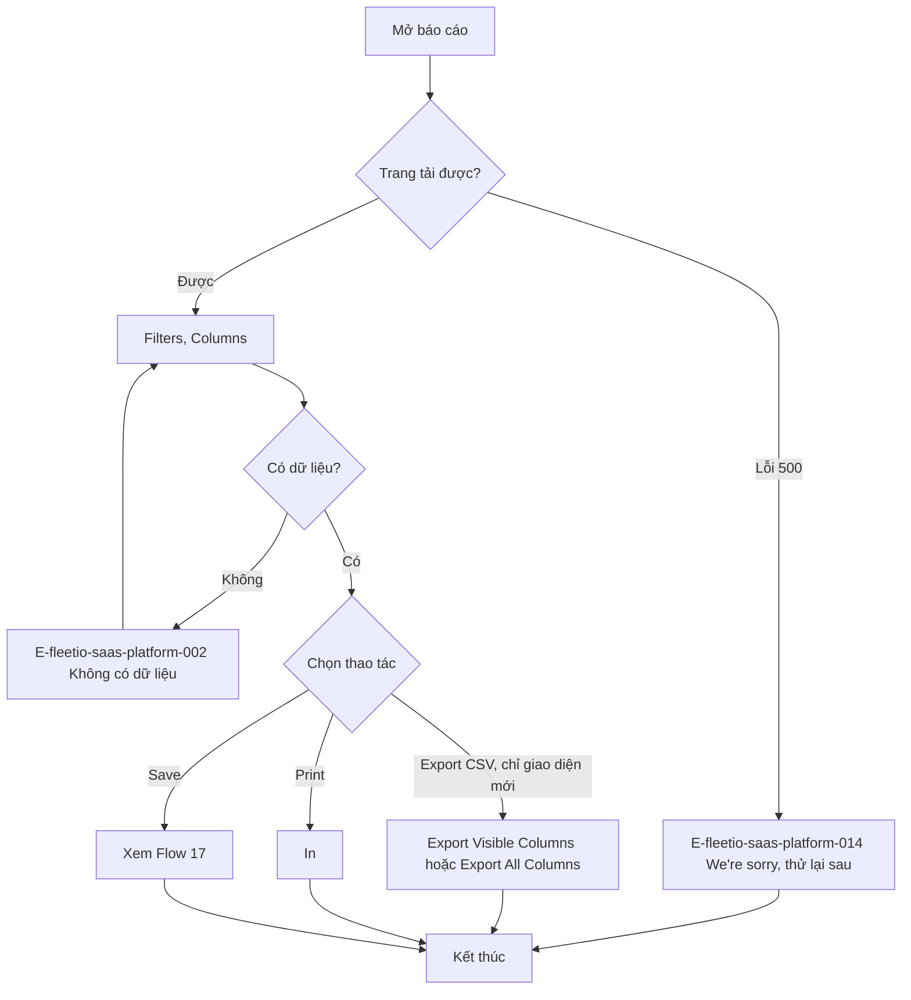
```mermaid
flowchart TD
    A["Mở báo cáo"] --> A1{"Trang tải được?"}
    A1 -->|"Lỗi 500"| A2["E-fleetio-saas-platform-014 We're sorry, thử lại sau"]
    A1 -->|"Được"| B["Filters, Columns"]
    B --> C{"Có dữ liệu?"}
    C -->|"Không"| D["E-fleetio-saas-platform-002 Không có dữ liệu"]
    D --> B
    C -->|"Có"| E{"Chọn thao tác"}
    E -->|"Export CSV, chỉ giao diện mới"| F["Export Visible Columns hoặc Export All Columns"]
    E -->|"Print"| G["In"]
    E -->|"Save"| H["Xem Flow 17"]
    A2 --> Z["Kết thúc"]
    F --> Z
    G --> Z
    H --> Z
```

Giao diện cũ không thấy nút Share, Export CSV; `vehicles/details`, `work_order_status_changes/summary` không có Export CSV (FR-fleetio-saas-platform-054).

## Flow 11: Hỏi dữ liệu bằng lời (`Chạy` 2 câu lượt 2; lượt 3 xem Flow 20)

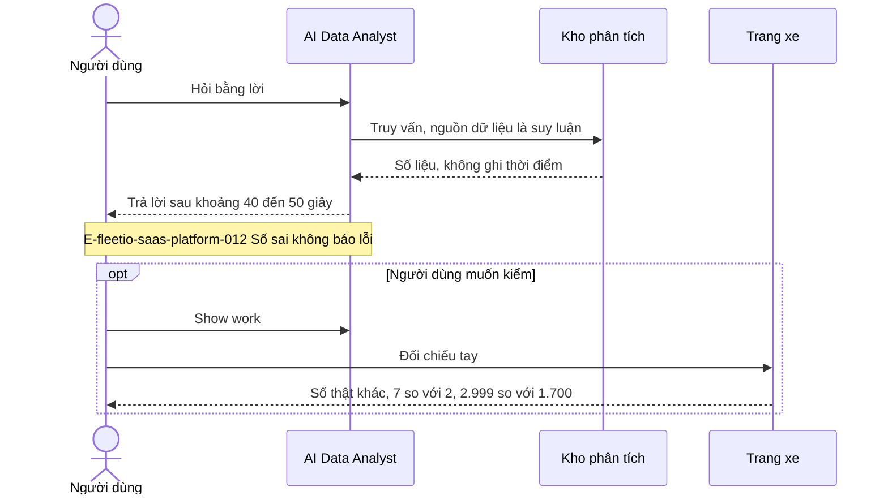
```mermaid
sequenceDiagram
    actor U as Người dùng
    participant A as AI Data Analyst
    participant K as Kho phân tích
    participant X as Trang xe
    U->>A: Hỏi bằng lời
    A->>K: Truy vấn, nguồn dữ liệu là suy luận
    K-->>A: Số liệu, không ghi thời điểm
    A-->>U: Trả lời sau khoảng 40 đến 50 giây
    Note over U,A: E-fleetio-saas-platform-012 Số sai không báo lỗi
    opt Người dùng muốn kiểm
        U->>A: Show work
        U->>X: Đối chiếu tay
        X-->>U: Số thật khác, 7 so với 2, 2.999 so với 1.700
    end
```

## Flow 12: Từ trang đầu tới việc cần xử lý (`Chạy`)

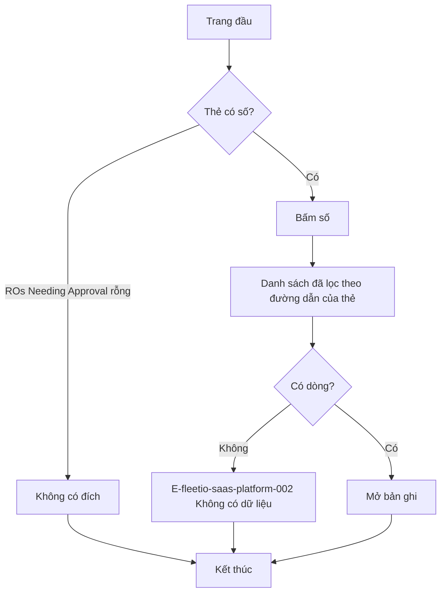
```mermaid
flowchart TD
    A["Trang đầu"] --> B{"Thẻ có số?"}
    B -->|"Có"| C["Bấm số"]
    B -->|"ROs Needing Approval rỗng"| D["Không có đích"]
    C --> E["Danh sách đã lọc theo đường dẫn của thẻ"]
    E --> F{"Có dòng?"}
    F -->|"Không"| G["E-fleetio-saas-platform-002 Không có dữ liệu"]
    F -->|"Có"| H["Mở bản ghi"]
    D --> Z["Kết thúc"]
    G --> Z
    H --> Z
```

## Flow 13: Bật luật theo khách (`Xem`, không Save)

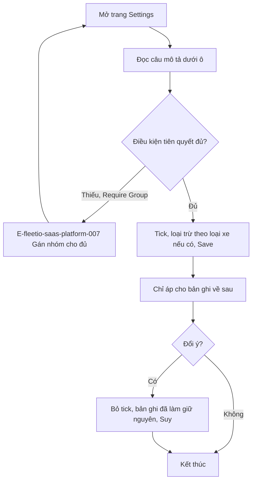
```mermaid
flowchart TD
    A["Mở trang Settings"] --> B["Đọc câu mô tả dưới ô"]
    B --> C{"Điều kiện tiên quyết đủ?"}
    C -->|"Thiếu, Require Group"| D["E-fleetio-saas-platform-007 Gán nhóm cho đủ"]
    D --> A
    C -->|"Đủ"| E["Tick, loại trừ theo loại xe nếu có, Save"]
    E --> F["Chỉ áp cho bản ghi về sau"]
    F --> G{"Đổi ý?"}
    G -->|"Có"| H["Bỏ tick, bản ghi đã làm giữ nguyên, Suy"]
    G -->|"Không"| Z["Kết thúc"]
    H --> Z
```

## Flow 14: Sửa automation đang bật, xem phiên bản (`Chạy`)

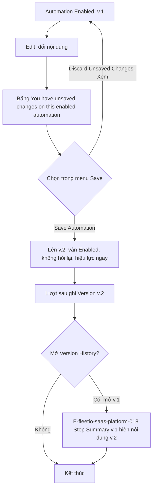
```mermaid
flowchart TD
    A["Automation Enabled, v.1"] --> B["Edit, đổi nội dung"]
    B --> C["Băng You have unsaved changes on this enabled automation"]
    C --> D{"Chọn trong menu Save"}
    D -->|"Discard Unsaved Changes, Xem"| A
    D -->|"Save Automation"| E["Lên v.2, vẫn Enabled, không hỏi lại, hiệu lực ngay"]
    E --> F["Lượt sau ghi Version v.2"]
    F --> G{"Mở Version History?"}
    G -->|"Có, mở v.1"| H["E-fleetio-saas-platform-018 Step Summary v.1 hiện nội dung v.2"]
    G -->|"Không"| Z["Kết thúc"]
    H --> Z
```

Đảo ngược: không thấy nút khôi phục phiên bản cũ trong lượt chạy; muốn quay lại phải sửa tay rồi lưu thành bản mới (`Suy`).

## Flow 15: Lượt automation thất bại (`Chạy`)

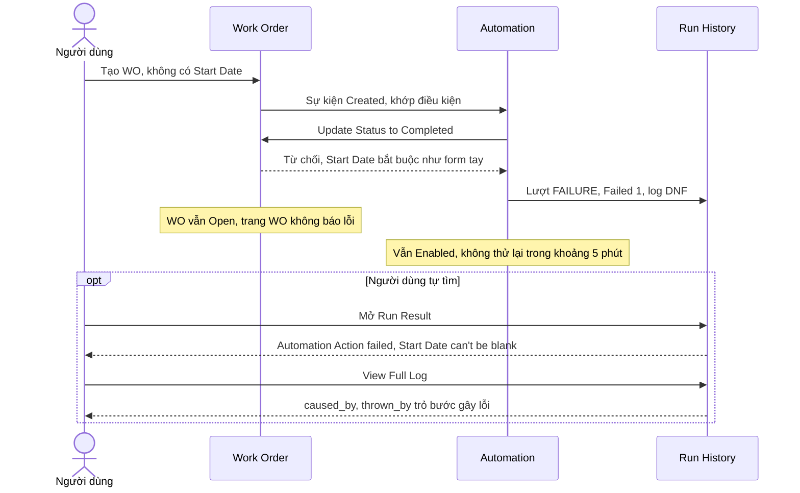
```mermaid
sequenceDiagram
    actor U as Người dùng
    participant W as Work Order
    participant E as Automation
    participant H as Run History
    U->>W: Tạo WO, không có Start Date
    W->>E: Sự kiện Created, khớp điều kiện
    E->>W: Update Status to Completed
    W-->>E: Từ chối, Start Date bắt buộc như form tay
    E->>H: Lượt FAILURE, Failed 1, log DNF
    Note over W: WO vẫn Open, trang WO không báo lỗi
    Note over E: Vẫn Enabled, không thử lại trong khoảng 5 phút
    opt Người dùng tự tìm
        U->>H: Mở Run Result
        H-->>U: Automation Action failed, Start Date can't be blank
        U->>H: View Full Log
        H-->>U: caused_by, thrown_by trỏ bước gây lỗi
    end
```

E-fleetio-saas-platform-011. Failure Notification Email đang tắt nên không có kênh báo nào khác; nội dung email chưa biết (OQ-6). Đảo ngược: sửa dữ liệu không chạy lại lượt cũ theo những gì đã thấy; tắt automation bằng công tắc.

## Flow 16: Luật ghi đè thao tác tay (`Chạy`)

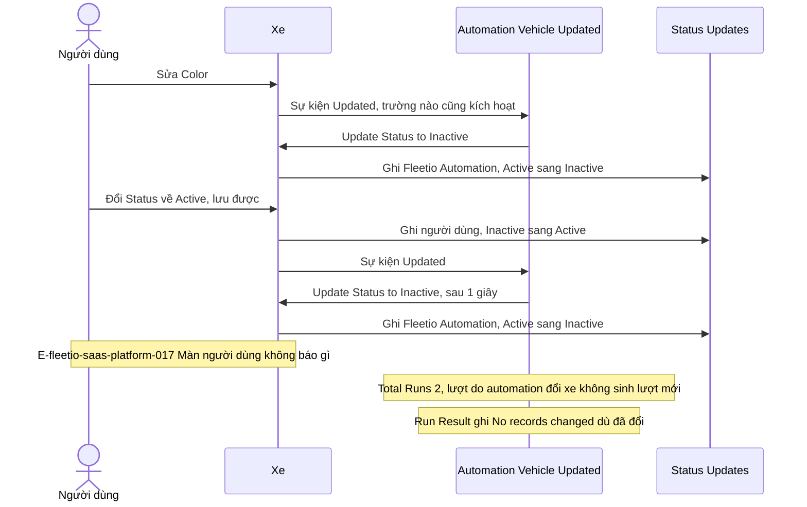
```mermaid
sequenceDiagram
    actor U as Người dùng
    participant V as Xe
    participant E as Automation Vehicle Updated
    participant S as Status Updates
    U->>V: Sửa Color
    V->>E: Sự kiện Updated, trường nào cũng kích hoạt
    E->>V: Update Status to Inactive
    V->>S: Ghi Fleetio Automation, Active sang Inactive
    U->>V: Đổi Status về Active, lưu được
    V->>S: Ghi người dùng, Inactive sang Active
    V->>E: Sự kiện Updated
    E->>V: Update Status to Inactive, sau 1 giây
    V->>S: Ghi Fleetio Automation, Active sang Inactive
    Note over U,V: E-fleetio-saas-platform-017 Màn người dùng không báo gì
    Note over E: Total Runs 2, lượt do automation đổi xe không sinh lượt mới
    Note over E: Run Result ghi No records changed dù đã đổi
```

Đảo ngược: tắt automation rồi người dùng đổi Status về Active. Đề xuất Invlogis: báo ngay người sửa nêu tên luật, thêm điều kiện "chỉ khi Status đổi" (NFR-fleetio-saas-platform-013).

## Flow 17: Lọc, lưu, yêu thích báo cáo (`Chạy` Private)

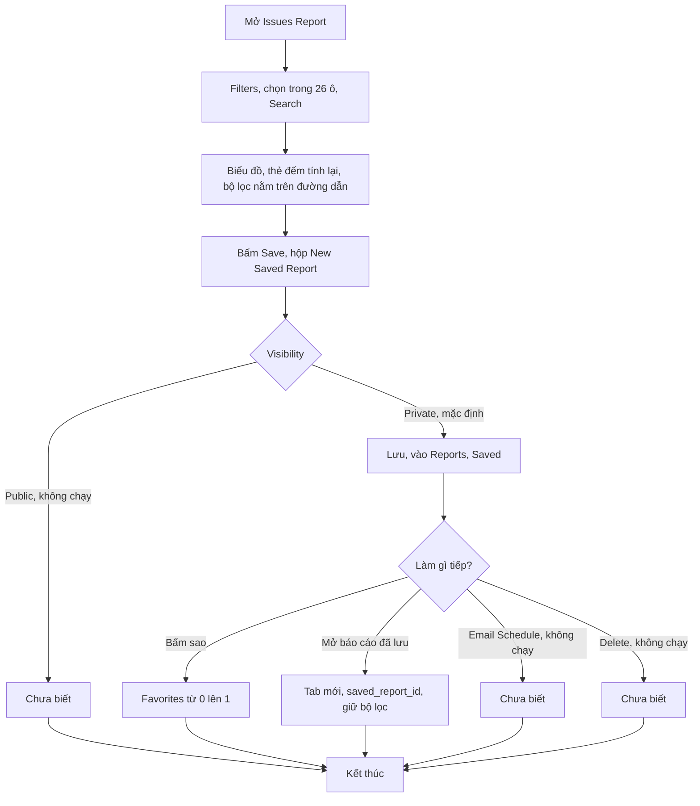
```mermaid
flowchart TD
    A["Mở Issues Report"] --> B["Filters, chọn trong 26 ô, Search"]
    B --> C["Biểu đồ, thẻ đếm tính lại, bộ lọc nằm trên đường dẫn"]
    C --> D["Bấm Save, hộp New Saved Report"]
    D --> E{"Visibility"}
    E -->|"Private, mặc định"| F["Lưu, vào Reports, Saved"]
    E -->|"Public, không chạy"| G["Chưa biết"]
    F --> H{"Làm gì tiếp?"}
    H -->|"Bấm sao"| I["Favorites từ 0 lên 1"]
    H -->|"Mở báo cáo đã lưu"| J["Tab mới, saved_report_id, giữ bộ lọc"]
    H -->|"Email Schedule, không chạy"| K["Chưa biết"]
    H -->|"Delete, không chạy"| L["Chưa biết"]
    G --> Z["Kết thúc"]
    I --> Z
    J --> Z
    K --> Z
    L --> Z
```

## Flow 18: Lưu chế độ xem trên danh sách (`Chạy` Private)

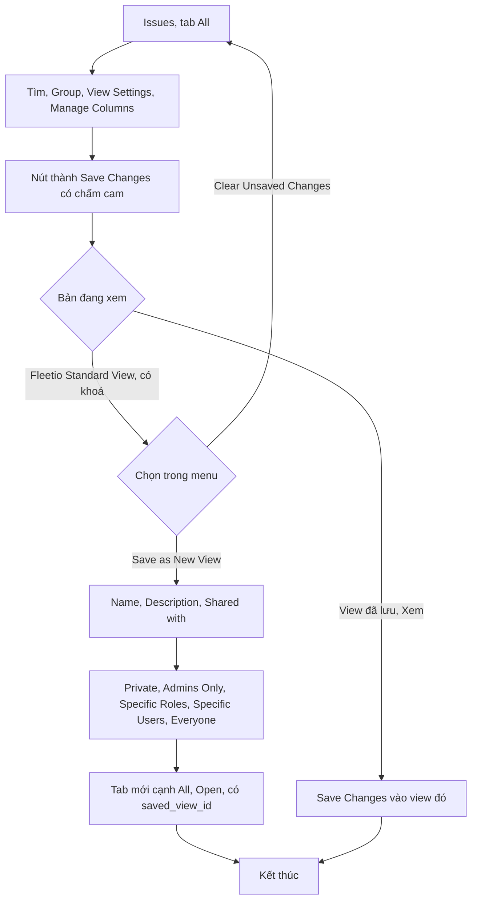
```mermaid
flowchart TD
    A["Issues, tab All"] --> B["Tìm, Group, View Settings, Manage Columns"]
    B --> C["Nút thành Save Changes có chấm cam"]
    C --> D{"Bản đang xem"}
    D -->|"Fleetio Standard View, có khoá"| E{"Chọn trong menu"}
    E -->|"Clear Unsaved Changes"| A
    E -->|"Save as New View"| F["Name, Description, Shared with"]
    F --> G["Private, Admins Only, Specific Roles, Specific Users, Everyone"]
    G --> H["Tab mới cạnh All, Open, có saved_view_id"]
    D -->|"View đã lưu, Xem"| I["Save Changes vào view đó"]
    H --> Z["Kết thúc"]
    I --> Z
```

Đã lưu Private; các mức chia sẻ khác không chạy. Mở lại /issues về đúng tab dùng lần trước.

## Flow 19: Tải và gắn tài liệu (`Chạy` tải, gắn 1 xe)

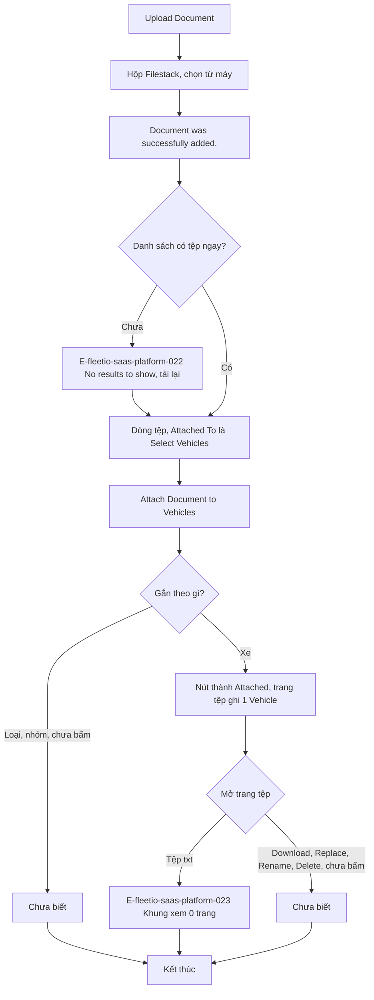
```mermaid
flowchart TD
    A["Upload Document"] --> B["Hộp Filestack, chọn từ máy"]
    B --> C["Document was successfully added."]
    C --> D{"Danh sách có tệp ngay?"}
    D -->|"Chưa"| E["E-fleetio-saas-platform-022 No results to show, tải lại"]
    E --> F
    D -->|"Có"| F["Dòng tệp, Attached To là Select Vehicles"]
    F --> G["Attach Document to Vehicles"]
    G --> H{"Gắn theo gì?"}
    H -->|"Xe"| I["Nút thành Attached, trang tệp ghi 1 Vehicle"]
    H -->|"Loại, nhóm, chưa bấm"| J["Chưa biết"]
    I --> K{"Mở trang tệp"}
    K -->|"Tệp txt"| L["E-fleetio-saas-platform-023 Khung xem 0 trang"]
    K -->|"Download, Replace, Rename, Delete, chưa bấm"| M["Chưa biết"]
    J --> Z["Kết thúc"]
    L --> Z
    M --> Z
```

## Flow 20: Hỏi dữ liệu với xe mới tạo (`Chạy`, lượt 3)

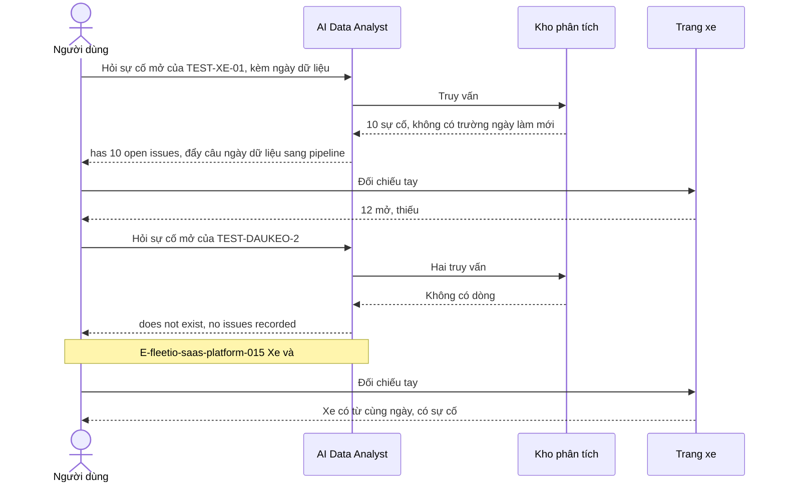
```mermaid
sequenceDiagram
    actor U as Người dùng
    participant A as AI Data Analyst
    participant K as Kho phân tích
    participant X as Trang xe
    U->>A: Hỏi sự cố mở của TEST-XE-01, kèm ngày dữ liệu
    A->>K: Truy vấn
    K-->>A: 10 sự cố, không có trường ngày làm mới
    A-->>U: has 10 open issues, đẩy câu ngày dữ liệu sang pipeline
    U->>X: Đối chiếu tay
    X-->>U: 12 mở, thiếu #49, #51
    U->>A: Hỏi sự cố mở của TEST-DAUKEO-2
    A->>K: Hai truy vấn
    K-->>A: Không có dòng
    A-->>U: does not exist, no issues recorded
    Note over U,A: E-fleetio-saas-platform-015 Xe và #54, #55 có thật
    U->>X: Đối chiếu tay
    X-->>U: Xe có từ cùng ngày, có sự cố
```

Khả năng kho trễ là `Suy` (nguồn dữ liệu trong sơ đồ cũng là suy luận). Chưa giải thích #49, #51 (OQ-13). Mở lại chat cũ có banner "This data may have changed since the last time you had a chat."

## Flow 21: AI xếp mức sự cố chạy nền (`Chạy`)

```mermaid
flowchart TD
    A["Tạo Issue, không nhập mức"] --> B["Priority Auto-assign, Prioritizing"]
    B --> C{"AI xếp được?"}
    C -->|"Có"| D["Issue có mức, ví dụ High"]
    C -->|"Thất bại"| E["E-fleetio-saas-platform-016 Về No Priority"]
    E --> F["Chỉ một dòng Record History, ghi Changes By là người tạo"]
    F --> G{"Người dùng có mở lịch sử?"}
    G -->|"Không"| H["Không biết AI đã lỗi"]
    G -->|"Có"| I["Đọc pending to failed"]
    D --> Z["Kết thúc"]
    H --> Z
    I --> Z
```

Nhánh tự chọn mức tay sau khi lỗi là `Suy`, chưa thao tác. Điều kiện thất bại chưa biết (OQ-20).

## Flow 22: Theo dõi, bình luận, nhận thông báo (`Chạy`)

```mermaid
flowchart TD
    A["Trang chi tiết Issue"] --> B{"Thao tác"}
    B -->|"Gõ @"| C{"Khớp đúng ký tự?"}
    C -->|"Không dấu hoặc có gạch nối"| D["E-fleetio-saas-platform-020 Không ra người, đăng thành chữ thường"]
    C -->|"Khớp, chưa nhắc ai thật"| E["Chưa biết"]
    B -->|"Unwatch"| F["Mất khỏi cụm người theo dõi"]
    F -->|"Watch"| A
    B -->|"Sự kiện từ automation"| G["Comment tác giả Fleetio Automation"]
    G --> H["Người theo dõi nhận in-app, kể cả 0 hồ sơ"]
    H --> I["Chuông, Inbox, Reply, View All Comments"]
    I -->|"Archive all, chưa bấm"| J["Chưa biết"]
    D --> Z["Kết thúc"]
    E --> Z
    J --> Z
```

Comment, Watch không ghi vào Record History.

## Flow 23: Automation tự duyệt đơn mua, có nhánh chặn và đảo ngược (`Chạy` phần chặn, phần comment; lượt 4)

```mermaid
flowchart TD
    A["Trigger Purchase Order Updated, Vendor is any of"] --> B["Update Field Status, chỉ Rejected, Approved"]
    B --> C{"Có điều kiện Status Pending Approval?"}
    C -->|"Chưa"| D["E-fleetio-saas-platform-026 Cảnh báo cam, Save bị chặn"]
    D --> E{"Xử lý"}
    E -->|"Resolve error, thêm điều kiện"| F["Lưu được, tự duyệt chỉ đơn đã nộp"]
    E -->|"Đổi Add Comment"| G["Lưu được, bật"]
    F --> H["Chưa chạy, tài khoản duyệt không tạo được đơn Pending"]
    C -->|"Có"| F
    G --> I{"Bản ghi đổi?"}
    I -->|"Lưu lại không đổi gì"| J["0 lượt"]
    I -->|"Approve đơn"| K["1 lượt, comment Fleetio Automation, không kích lại"]
    K --> L{"Archive?"}
    L -->|"Có"| M["Tắt ngay, đổi đơn không sinh lượt"]
    M -->|"Restore, không hộp xác nhận"| N["Disabled, giữ v.1, Run History"]
    L -->|"Không"| Z["Kết thúc"]
    H --> Z
    J --> Z
    N --> Z
```

Nhánh Service Entry: Update Field Repair Priority Class = Emergency chọn và Apply được nhưng Save bị từ chối (E-fleetio-saas-platform-025); đổi Add Comment thì chạy, entry xe khác không tính lượt.

## Flow 24: Lọc báo cáo theo 3 kiểu bộ lọc (`Chạy` đọc, lọc thật 1 báo cáo; lượt 4)

```mermaid
flowchart TD
    A["Mở báo cáo"] --> B{"Trang tải được?"}
    B -->|"Không, expense_entries"| C["E-fleetio-saas-platform-014 Lỗi 500"]
    B -->|"Được"| D{"Kiểu bộ lọc"}
    D -->|"A, đa số báo cáo mới"| E["Panel ô cố định, Search"]
    D -->|"B, 9 báo cáo"| F["No filters applied, Add Filter, Popular Filters"]
    D -->|"C, 4 báo cáo"| G["Thanh lọc trên báo cáo, Add Filter, Apply"]
    D -->|"Không có, job_assignments_summary_by_job"| H["Chỉ có Save"]
    E --> I["1 filter applied, Clear all, đường dẫn giữ điều kiện"]
    I --> J{"purchase_orders có đơn Draft?"}
    J -->|"Có"| K["E-fleetio-saas-platform-027 Total Amount gồm Draft"]
    J -->|"Không, chưa thử"| L["Chưa biết"]
    I -->|"Clear all, chưa bấm"| E
    F --> Z["Kết thúc"]
    G --> Z
    H --> Z
    C --> Z
    K --> Z
    L --> Z
```
