# Phương tiện — Flows

Mã lỗi viết tắt `E-0NN` là `E-fleetio-vehicle-0NN`. Mức ghi ở tiêu đề từng luồng. Luồng lốp: [[docs/_research/fleetio/srs/fleetio-tires-flows.md|Flows Lốp]].

## Flow 1: Gán xe (`Chạy`)

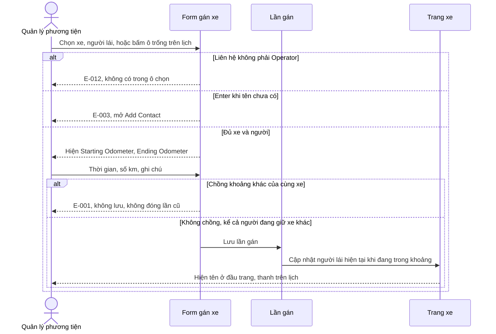
```mermaid
sequenceDiagram
    actor M as Quản lý phương tiện
    participant F as Form gán xe
    participant A as Lần gán
    participant V as Trang xe
    M->>F: Chọn xe, người lái, hoặc bấm ô trống trên lịch
    alt Liên hệ không phải Operator
        F-->>M: E-012, không có trong ô chọn
    else Enter khi tên chưa có
        F-->>M: E-003, mở Add Contact
    else Đủ xe và người
        F-->>M: Hiện Starting Odometer, Ending Odometer
        M->>F: Thời gian, số km, ghi chú
        alt Chồng khoảng khác của cùng xe
            F-->>M: E-001, không lưu, không đóng lần cũ
        else Không chồng, kể cả người đang giữ xe khác
            F->>A: Lưu lần gán
            A->>V: Cập nhật người lái hiện tại khi đang trong khoảng
            V-->>M: Hiện tên ở đầu trang, thanh trên lịch
        end
    end
```

Nhánh đảo ngược: Delete trên menu thanh (`Xem`, chưa bấm). Múi giờ: E-017.

## Flow 2: Đổi người lái giữa chừng (`Chạy`)

Fleetio không có hành động riêng. Có hai đường.

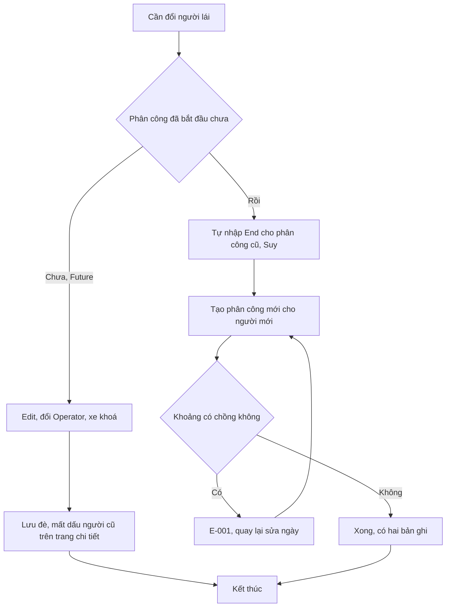
```mermaid
flowchart TD
    A["Cần đổi người lái"] --> B{"Phân công đã bắt đầu chưa"}
    B -->|"Chưa, Future"| C["Edit, đổi Operator, xe khoá"]
    C --> D["Lưu đè, mất dấu người cũ trên trang chi tiết"]
    B -->|"Rồi"| E["Tự nhập End cho phân công cũ, Suy"]
    E --> F["Tạo phân công mới cho người mới"]
    F --> G{"Khoảng có chồng không"}
    G -->|"Có"| H["E-001, quay lại sửa ngày"]
    H --> F
    G -->|"Không"| I["Xong, có hai bản ghi"]
    D --> J["Kết thúc"]
    I --> J
```

Sửa phân công đã qua chưa thử.

## Flow 3: Ghi số đồng hồ (`Chạy`; Out of Sequence `Chạy` một ca từ Fleetio Go, telematics, API là `Docs`)

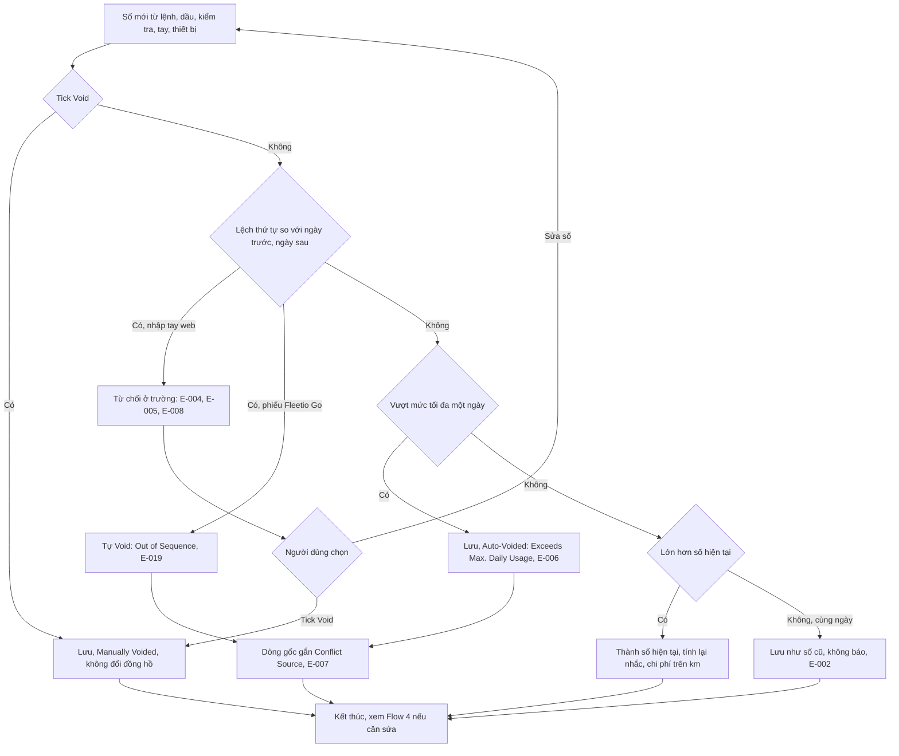
```mermaid
flowchart TD
    A["Số mới từ lệnh, dầu, kiểm tra, tay, thiết bị"] --> V{"Tick Void"}
    V -->|"Có"| MV["Lưu, Manually Voided, không đổi đồng hồ"]
    V -->|"Không"| B{"Lệch thứ tự so với ngày trước, ngày sau"}
    B -->|"Có, nhập tay web"| R["Từ chối ở trường: E-004, E-005, E-008"]
    R --> R2{"Người dùng chọn"}
    R2 -->|"Sửa số"| A
    R2 -->|"Tick Void"| MV
    B -->|"Có, phiếu Fleetio Go"| OS["Tự Void: Out of Sequence, E-019"]
    B -->|"Không"| C{"Vượt mức tối đa một ngày"}
    C -->|"Có"| AV["Lưu, Auto-Voided: Exceeds Max. Daily Usage, E-006"]
    AV --> CS["Dòng gốc gắn Conflict Source, E-007"]
    C -->|"Không"| D{"Lớn hơn số hiện tại"}
    D -->|"Có"| G["Thành số hiện tại, tính lại nhắc, chi phí trên km"]
    D -->|"Không, cùng ngày"| H["Lưu như số cũ, không báo, E-002"]
    OS --> CS
    CS --> K["Kết thúc, xem Flow 4 nếu cần sửa"]
    MV --> K
    G --> K
    H --> K
```

Biên ngưỡng (Fleetio): đúng +4.828 km vẫn là "Đạt", +4.829 km tự Void. Nguồn telematics, API lệch thứ tự: `Docs`, chưa thử. Đóng Lệnh đi qua cùng luật thứ tự: E-029.

## Flow 4: Sửa số sai, nhánh đảo ngược (`Chạy` phần Unvoid; `Docs` phần Void gốc)

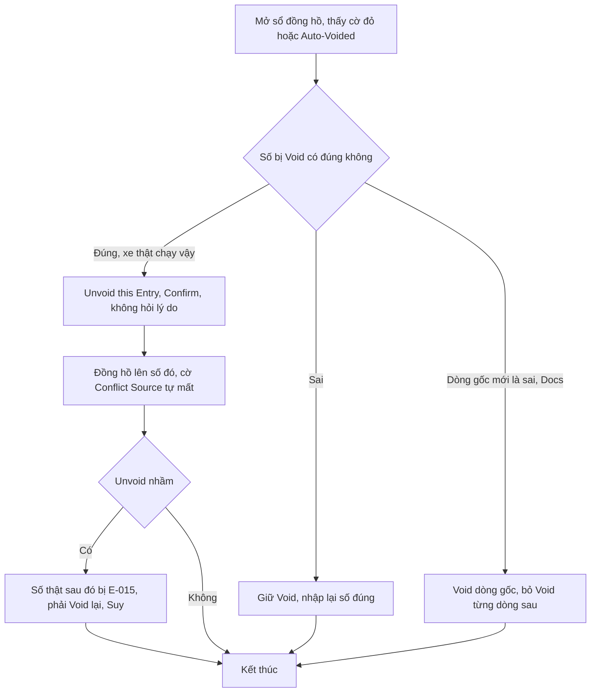
```mermaid
flowchart TD
    A["Mở sổ đồng hồ, thấy cờ đỏ hoặc Auto-Voided"] --> B{"Số bị Void có đúng không"}
    B -->|"Đúng, xe thật chạy vậy"| C["Unvoid this Entry, Confirm, không hỏi lý do"]
    C --> D["Đồng hồ lên số đó, cờ Conflict Source tự mất"]
    B -->|"Sai"| E["Giữ Void, nhập lại số đúng"]
    B -->|"Dòng gốc mới là sai, Docs"| F["Void dòng gốc, bỏ Void từng dòng sau"]
    D --> G{"Unvoid nhầm"}
    G -->|"Có"| H["Số thật sau đó bị E-015, phải Void lại, Suy"]
    G -->|"Không"| I["Kết thúc"]
    E --> I
    F --> I
    H --> I
```

Thay đồng hồ: xem Flow 11. Ca Out of Sequence: menu dòng có Edit, Unvoid, View Record History, Delete (`Xem`, chưa bấm).

## Flow 5: Tạo xe và mooc (`Chạy`)

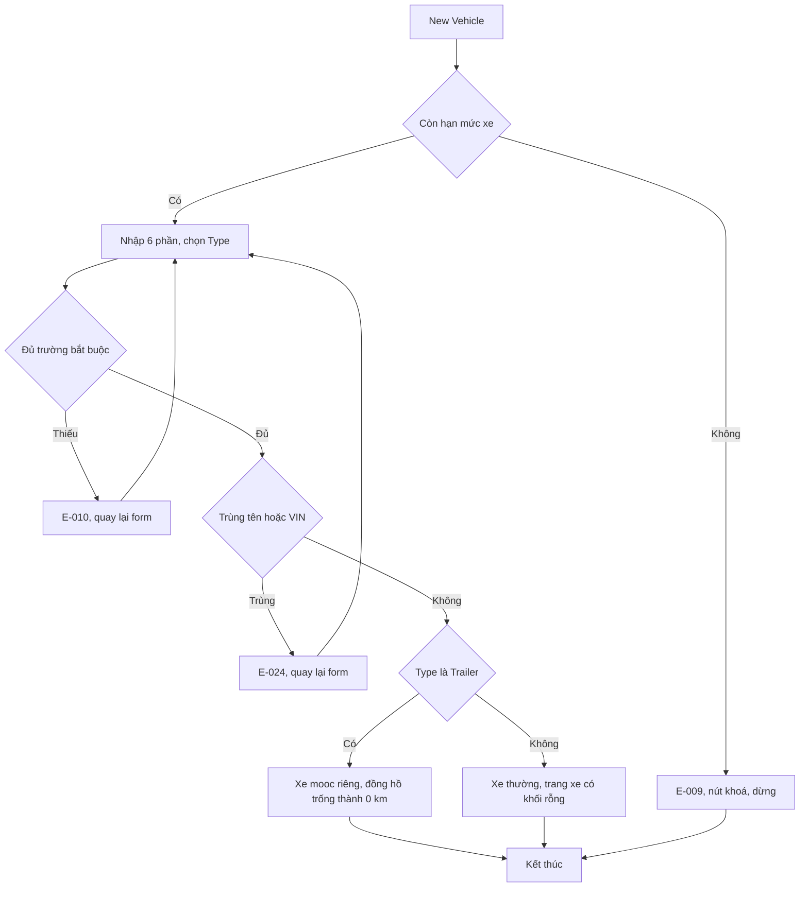
```mermaid
flowchart TD
    A["New Vehicle"] --> B{"Còn hạn mức xe"}
    B -->|"Không"| E9["E-009, nút khoá, dừng"]
    B -->|"Có"| C["Nhập 6 phần, chọn Type"]
    C --> D{"Đủ trường bắt buộc"}
    D -->|"Thiếu"| E10["E-010, quay lại form"]
    E10 --> C
    D -->|"Đủ"| D2{"Trùng tên hoặc VIN"}
    D2 -->|"Trùng"| E24["E-024, quay lại form"]
    E24 --> C
    D2 -->|"Không"| F{"Type là Trailer"}
    F -->|"Có"| G["Xe mooc riêng, đồng hồ trống thành 0 km"]
    F -->|"Không"| H["Xe thường, trang xe có khối rỗng"]
    G --> Z["Kết thúc"]
    H --> Z
    E9 --> Z
```

Tạo nhiều xe: Flow 12. Giải mã VIN trong form: Flow 13.

## Flow 6: Liên kết đầu kéo và mooc (`Chạy`)

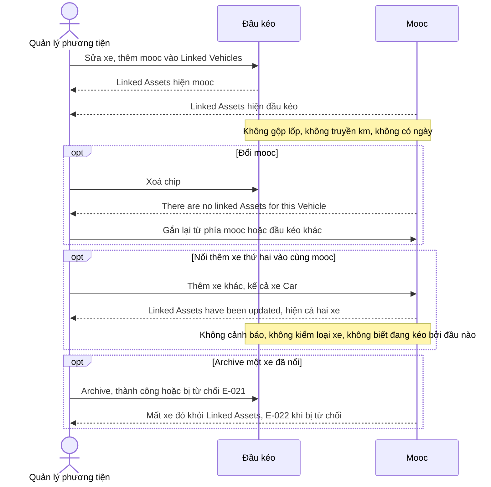
```mermaid
sequenceDiagram
    actor M as Quản lý phương tiện
    participant D as Đầu kéo
    participant T as Mooc
    M->>D: Sửa xe, thêm mooc vào Linked Vehicles
    D-->>M: Linked Assets hiện mooc
    T-->>M: Linked Assets hiện đầu kéo
    Note over D,T: Không gộp lốp, không truyền km, không có ngày
    opt Đổi mooc
        M->>D: Xoá chip
        T-->>M: There are no linked Assets for this Vehicle
        M->>T: Gắn lại từ phía mooc hoặc đầu kéo khác
    end
    opt Nối thêm xe thứ hai vào cùng mooc
        M->>T: Thêm xe khác, kể cả xe Car
        T-->>M: Linked Assets have been updated, hiện cả hai xe
        Note over D,T: Không cảnh báo, không kiểm loại xe, không biết đang kéo bởi đầu nào
    end
    opt Archive một xe đã nối
        M->>D: Archive, thành công hoặc bị từ chối E-021
        T-->>M: Mất xe đó khỏi Linked Assets, E-022 khi bị từ chối
    end
```

Một mooc nối nhiều xe: `Chạy` lượt 3 (OQ-16).

## Flow 7: Chi phí và chi phí trên km (`Chạy`)

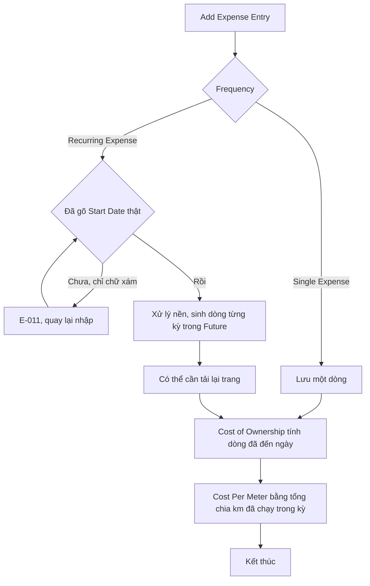
```mermaid
flowchart TD
    A["Add Expense Entry"] --> B{"Frequency"}
    B -->|"Single Expense"| C["Lưu một dòng"]
    B -->|"Recurring Expense"| D{"Đã gõ Start Date thật"}
    D -->|"Chưa, chỉ chữ xám"| E["E-011, quay lại nhập"]
    E --> D
    D -->|"Rồi"| F["Xử lý nền, sinh dòng từng kỳ trong Future"]
    F --> G["Có thể cần tải lại trang"]
    C --> H["Cost of Ownership tính dòng đã đến ngày"]
    G --> H
    H --> I["Cost Per Meter bằng tổng chia km đã chạy trong kỳ"]
    I --> J["Kết thúc"]
```

Xoá, sửa dòng định kỳ: chưa thử.

## Flow 8: Bảo hành và cơ hội trên lệnh (`Chạy`; claim chưa thử)

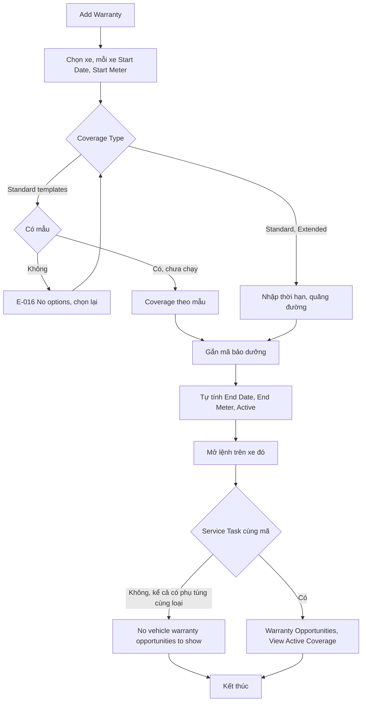
```mermaid
flowchart TD
    A["Add Warranty"] --> B["Chọn xe, mỗi xe Start Date, Start Meter"]
    B --> C{"Coverage Type"}
    C -->|"Standard templates"| T{"Có mẫu"}
    T -->|"Không"| U["E-016 No options, chọn lại"]
    U --> C
    T -->|"Có, chưa chạy"| D["Coverage theo mẫu"]
    C -->|"Standard, Extended"| D2["Nhập thời hạn, quãng đường"]
    D --> E["Gắn mã bảo dưỡng"]
    D2 --> E
    E --> F["Tự tính End Date, End Meter, Active"]
    F --> G["Mở lệnh trên xe đó"]
    G --> H{"Service Task cùng mã"}
    H -->|"Không, kể cả có phụ tùng cùng loại"| I["No vehicle warranty opportunities to show"]
    H -->|"Có"| J["Warranty Opportunities, View Active Coverage"]
    I --> K["Kết thúc"]
    J --> K
```

E-014: Start Meter nhập 1000 hiện 1 km.

## Flow 9: Đổi trạng thái, Archive (`Chạy`; quyền `Xem`; Motor Pool `Xem` câu chữ)

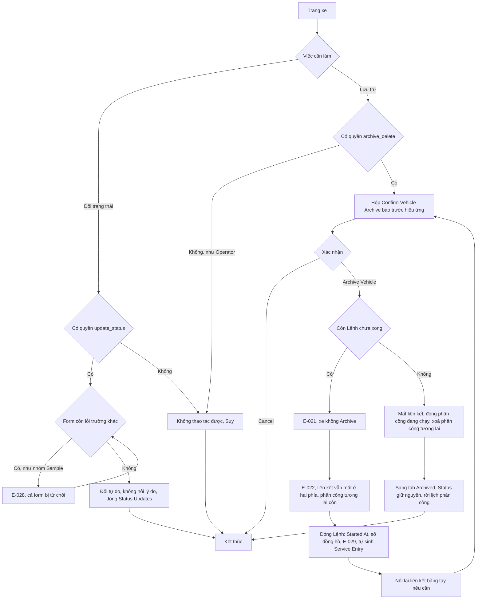
```mermaid
flowchart TD
    A["Trang xe"] --> B{"Việc cần làm"}
    B -->|"Đổi trạng thái"| C{"Có quyền update_status"}
    C -->|"Có"| C2{"Form còn lỗi trường khác"}
    C2 -->|"Có, như nhóm Sample"| E28["E-028, cả form bị từ chối"]
    E28 --> C2
    C2 -->|"Không"| D["Đổi tự do, không hỏi lý do, dòng Status Updates"]
    C -->|"Không"| E["Không thao tác được, Suy"]
    B -->|"Lưu trữ"| F{"Có quyền archive_delete"}
    F -->|"Không, như Operator"| E
    F -->|"Có"| F2["Hộp Confirm Vehicle Archive báo trước hiệu ứng"]
    F2 --> F3{"Xác nhận"}
    F3 -->|"Cancel"| H["Kết thúc"]
    F3 -->|"Archive Vehicle"| G{"Còn Lệnh chưa xong"}
    G -->|"Có"| E21["E-021, xe không Archive"]
    E21 --> E22["E-022, liên kết vẫn mất ở hai phía, phân công tương lai còn"]
    E22 --> W["Đóng Lệnh: Started At, số đồng hồ, E-029, tự sinh Service Entry"]
    W --> N["Nối lại liên kết bằng tay nếu cần"]
    N --> F2
    G -->|"Không"| K["Mất liên kết, đóng phân công đang chạy, xoá phân công tương lai"]
    K --> L["Sang tab Archived, Status giữ nguyên, rời lịch phân công"]
    D --> H
    E --> H
    L --> H
```

Motor Pool đang đặt cũng chặn Archive theo câu trong hộp, chưa tạo đặt xe để thử. Automation đổi trạng thái: mẫu `Xem`, một automation tự tạo đã `Chạy` (người đổi ngược bị lật lại sau khoảng 1 giây, không báo), xem nhóm Nền tảng.

## Flow 10: Phân tích thay xe (`Chạy` đọc)

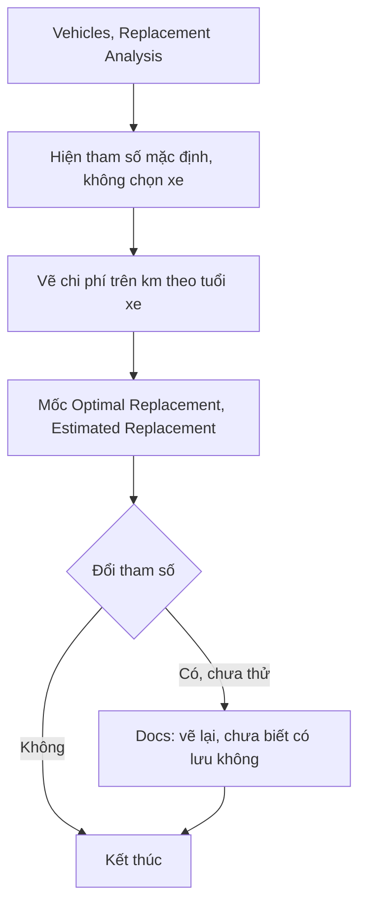
```mermaid
flowchart TD
    A["Vehicles, Replacement Analysis"] --> B["Hiện tham số mặc định, không chọn xe"]
    B --> C["Vẽ chi phí trên km theo tuổi xe"]
    C --> D["Mốc Optimal Replacement, Estimated Replacement"]
    D --> E{"Đổi tham số"}
    E -->|"Có, chưa thử"| F["Docs: vẽ lại, chưa biết có lưu không"]
    E -->|"Không"| G["Kết thúc"]
    F --> G
```

## Flow 11: Thay đồng hồ bằng Void hàng loạt (`Chạy`; số GPS là `Docs`)

Fleetio không có bước khai báo thay đồng hồ, không lưu lý do.

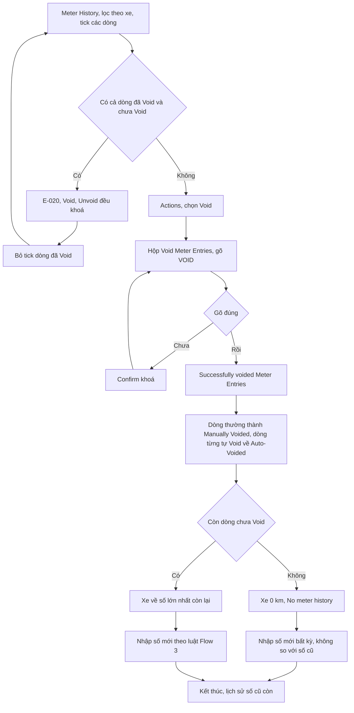
```mermaid
flowchart TD
    A["Meter History, lọc theo xe, tick các dòng"] --> B{"Có cả dòng đã Void và chưa Void"}
    B -->|"Có"| C["E-020, Void, Unvoid đều khoá"]
    C --> D["Bỏ tick dòng đã Void"]
    D --> A
    B -->|"Không"| E["Actions, chọn Void"]
    E --> F["Hộp Void Meter Entries, gõ VOID"]
    F --> G{"Gõ đúng"}
    G -->|"Chưa"| H["Confirm khoá"]
    H --> F
    G -->|"Rồi"| I["Successfully voided Meter Entries"]
    I --> J["Dòng thường thành Manually Voided, dòng từng tự Void về Auto-Voided"]
    J --> K{"Còn dòng chưa Void"}
    K -->|"Không"| L["Xe 0 km, No meter history"]
    K -->|"Có"| M["Xe về số lớn nhất còn lại"]
    L --> N["Nhập số mới bất kỳ, không so với số cũ"]
    M --> N2["Nhập số mới theo luật Flow 3"]
    N --> O["Kết thúc, lịch sử số cũ còn"]
    N2 --> O
```

Đảo ngược: Actions có Unvoid hàng loạt, Delete (`Xem`, chưa bấm). Xe về số lớn nhất còn lại khi chỉ Void một phần là `Suy` theo luật số hiện tại, lượt chạy đã Void toàn bộ. Đồng hồ phụ là chuỗi riêng (`Chạy`); Void số phụ chưa thử.

## Flow 12: Tạo nhiều xe (`Chạy` 1 dòng lỗi, 1 dòng hợp lệ; dán nhiều dòng chưa thử)

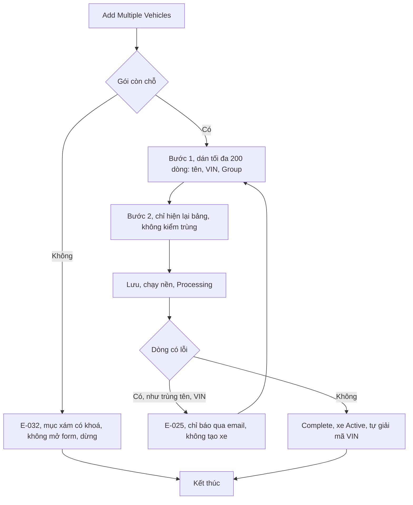
```mermaid
flowchart TD
    A["Add Multiple Vehicles"] --> B{"Gói còn chỗ"}
    B -->|"Không"| C["E-032, mục xám có khoá, không mở form, dừng"]
    B -->|"Có"| D["Bước 1, dán tối đa 200 dòng: tên, VIN, Group"]
    D --> E["Bước 2, chỉ hiện lại bảng, không kiểm trùng"]
    E --> F["Lưu, chạy nền, Processing"]
    F --> G{"Dòng có lỗi"}
    G -->|"Có, như trùng tên, VIN"| H["E-025, chỉ báo qua email, không tạo xe"]
    H --> D
    G -->|"Không"| I["Complete, xe Active, tự giải mã VIN"]
    C --> Z["Kết thúc"]
    I --> Z
```

Form đơn cùng dữ liệu trùng báo ngay ở trường: E-024.

## Flow 13: Giải mã VIN (`Chạy`)

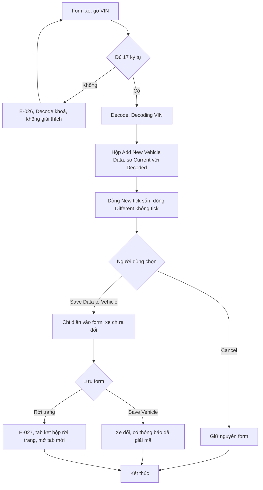
```mermaid
flowchart TD
    A["Form xe, gõ VIN"] --> B{"Đủ 17 ký tự"}
    B -->|"Không"| C["E-026, Decode khoá, không giải thích"]
    C --> A
    B -->|"Có"| D["Decode, Decoding VIN"]
    D --> E["Hộp Add New Vehicle Data, so Current với Decoded"]
    E --> F["Dòng New tick sẵn, dòng Different không tick"]
    F --> G{"Người dùng chọn"}
    G -->|"Cancel"| H["Giữ nguyên form"]
    G -->|"Save Data to Vehicle"| I["Chỉ điền vào form, xe chưa đổi"]
    I --> J{"Lưu form"}
    J -->|"Save Vehicle"| K["Xe đổi, có thông báo đã giải mã"]
    J -->|"Rời trang"| L["E-027, tab kẹt hộp rời trang, mở tab mới"]
    H --> Z["Kết thúc"]
    K --> Z
    L --> Z
```

## Flow 14: Restore xe (`Chạy`)

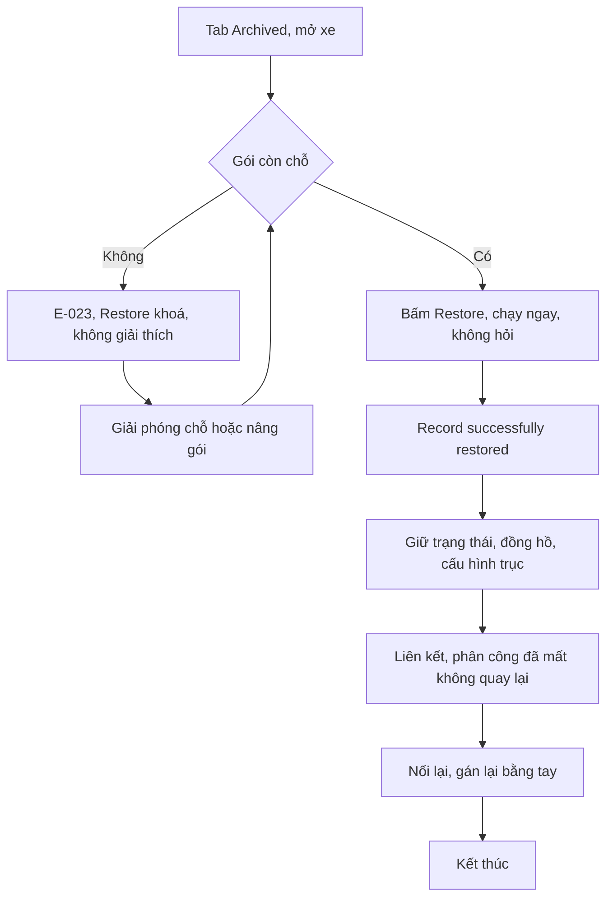
```mermaid
flowchart TD
    A["Tab Archived, mở xe"] --> B{"Gói còn chỗ"}
    B -->|"Không"| C["E-023, Restore khoá, không giải thích"]
    C --> D["Giải phóng chỗ hoặc nâng gói"]
    D --> B
    B -->|"Có"| E["Bấm Restore, chạy ngay, không hỏi"]
    E --> F["Record successfully restored"]
    F --> G["Giữ trạng thái, đồng hồ, cấu hình trục"]
    G --> H["Liên kết, phân công đã mất không quay lại"]
    H --> I["Nối lại, gán lại bằng tay"]
    I --> Z["Kết thúc"]
```

Bản gói đầy (`Chạy`) chưa giải phóng chỗ để thử lại, nên nhánh quay về là `Suy`.

## Flow 15: Tuỳ biến trang xe (`Chạy` phần thẻ cá nhân; layout tài khoản `Xem`)

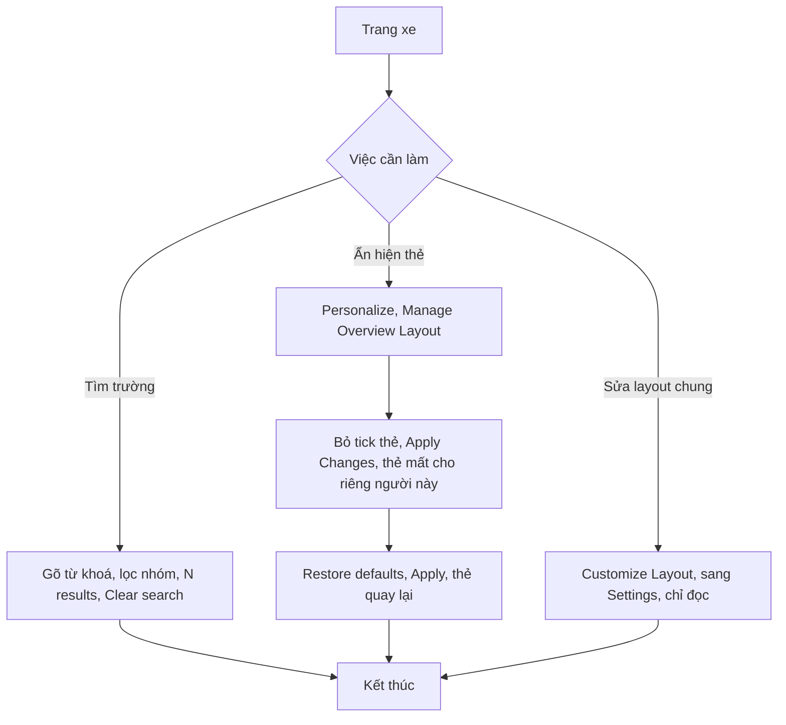
```mermaid
flowchart TD
    A["Trang xe"] --> B{"Việc cần làm"}
    B -->|"Tìm trường"| C["Gõ từ khoá, lọc nhóm, N results, Clear search"]
    B -->|"Ẩn hiện thẻ"| D["Personalize, Manage Overview Layout"]
    D --> E["Bỏ tick thẻ, Apply Changes, thẻ mất cho riêng người này"]
    E --> F["Restore defaults, Apply, thẻ quay lại"]
    B -->|"Sửa layout chung"| G["Customize Layout, sang Settings, chỉ đọc"]
    C --> Z["Kết thúc"]
    F --> Z
    G --> Z
```

## Flow 16: Bộ lịch và tài liệu từ More Actions (`Chạy`; Create Service Program chưa bấm)

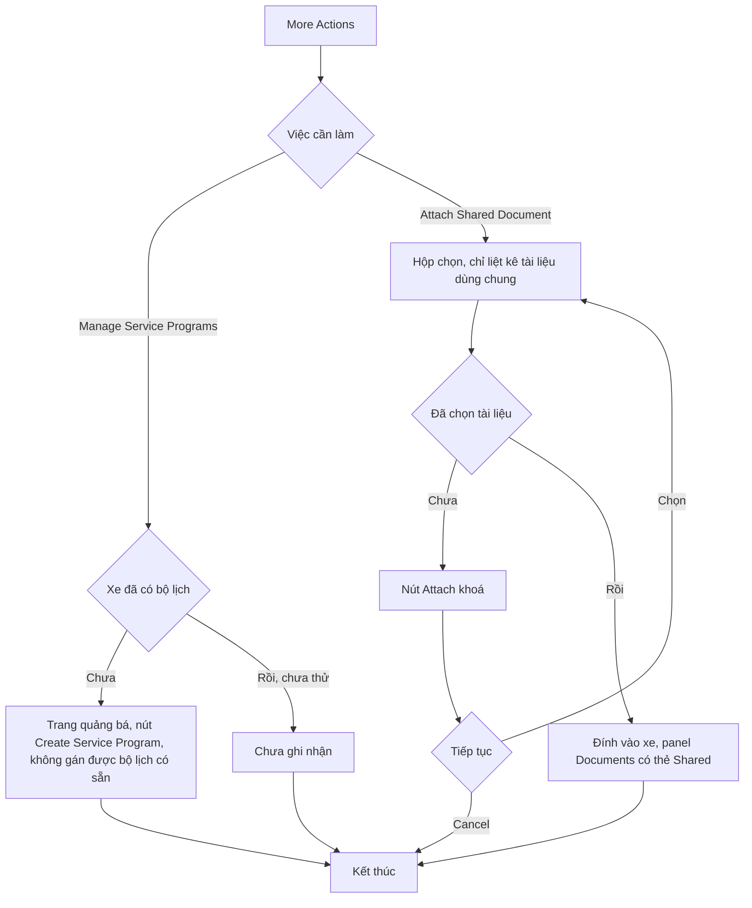
```mermaid
flowchart TD
    A["More Actions"] --> B{"Việc cần làm"}
    B -->|"Manage Service Programs"| C{"Xe đã có bộ lịch"}
    C -->|"Chưa"| D["Trang quảng bá, nút Create Service Program, không gán được bộ lịch có sẵn"]
    C -->|"Rồi, chưa thử"| E["Chưa ghi nhận"]
    B -->|"Attach Shared Document"| F["Hộp chọn, chỉ liệt kê tài liệu dùng chung"]
    F --> G{"Đã chọn tài liệu"}
    G -->|"Chưa"| H["Nút Attach khoá"]
    H --> I{"Tiếp tục"}
    I -->|"Chọn"| F
    I -->|"Cancel"| Z["Kết thúc"]
    G -->|"Rồi"| J["Đính vào xe, panel Documents có thẻ Shared"]
    D --> Z
    E --> Z
    J --> Z
```

Gỡ tài liệu đã đính: chưa thử.
